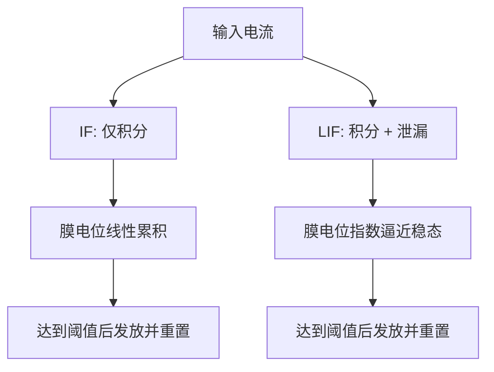
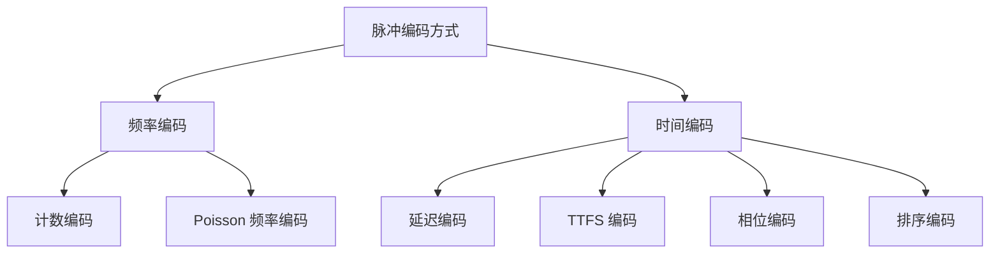

# 2.2 脉冲神经元模型与信息编码方式

脉冲神经网络的建模基础主要体现在两个方面：一是脉冲神经元模型，用于刻画神经元膜电位随时间演化的动态规律；二是信息编码方式，用于描述外部刺激或内部特征如何转换为脉冲序列并在网络中传播。前者决定神经元如何对输入进行积分、泄漏、触发与重置，后者决定信息以何种形式映射为脉冲事件。二者共同构成了脉冲神经网络实现信息处理的理论基础[1-4]。从计算实现角度看，若缺乏合适的神经元模型，网络难以形成合理的时序动态；若缺乏有效的编码方式，外部输入也难以稳定地转化为可被脉冲网络处理的事件流。因此，有必要对典型脉冲神经元模型及常用编码方式进行系统梳理，为后续训练方法分析与网络结构设计提供理论支撑。

## 2.2.1 IF 神经元模型

积分发放（Integrate-and-Fire, IF）神经元模型是脉冲神经网络中最基础的神经元模型之一，其思想最早可追溯到 Lapicque 于 1907 年提出的经典工作[5]。IF 模型以较为简洁的数学形式抽象了神经元对输入电流进行累积并在超过阈值时发放脉冲的基本过程。与更复杂的生物神经元模型相比，IF 模型忽略了离子通道动力学、动作电位形成细节以及树突电学特性，而重点保留“输入积分、阈值触发与状态重置”这一核心机制，因此在理论分析和工程实现中均具有较高的应用价值[1][6]。

在连续时间形式下，IF 神经元的膜电位动态可表示为

$$
C_m \frac{\mathrm{d}u(t)}{\mathrm{d}t}=I(t),
$$

其中，$C_m$ 表示膜电容，$u(t)$ 表示时刻 $t$ 的膜电位，$I(t)$ 表示输入电流。若将静息电位视为零参考点，则上式表明膜电位随输入电流持续积分。当初始膜电位为 $u(0)=u_0$ 时，其解析形式可写为

$$
u(t)=u_0+\frac{1}{C_m}\int_{0}^{t}I(\tau)\mathrm{d}\tau.
$$

当输入电流为常数 $I_0$ 时，膜电位随时间线性增长，即

$$
u(t)=u_0+\frac{I_0}{C_m}t.
$$

IF 神经元的发放条件通常定义为

$$
s(t)=H\left(u(t)-V_{\mathrm{th}}\right),
$$

其中，$V_{\mathrm{th}}$ 表示发放阈值，$H(\cdot)$ 为 Heaviside 阶跃函数。当 $u(t)\geq V_{\mathrm{th}}$ 时，神经元输出一个脉冲，并将膜电位重置为

$$
u(t^+)=u_{\mathrm{reset}}.
$$

若进一步考虑绝对不应期 $\tau_{\mathrm{ref}}$，则神经元在发放后的一段时间内不再响应输入，此时一个发放周期可表示为

$$
T_{\mathrm{IF}}=\frac{C_m\left(V_{\mathrm{th}}-u_{\mathrm{reset}}\right)}{I_0}+\tau_{\mathrm{ref}},
$$

相应的平均发放频率为

$$
f_{\mathrm{IF}}=\frac{1}{T_{\mathrm{IF}}}
=\left[\frac{C_m\left(V_{\mathrm{th}}-u_{\mathrm{reset}}\right)}{I_0}+\tau_{\mathrm{ref}}\right]^{-1}.
$$

由上式可以看出，在恒定输入电流条件下，IF 神经元的发放频率与输入强度呈单调关系。输入电流越强，膜电位达到阈值所需时间越短，神经元的发放频率越高。这一性质使 IF 模型能够以较低复杂度描述神经元对刺激强度变化的响应。

从离散时间实现角度看，当采用固定仿真步长 $\Delta t$ 时，IF 神经元可写为

$$
u^{t}=u^{t-1}+\frac{\Delta t}{C_m}I^{t},
$$

$$
s^{t}=H\left(u^{t}-V_{\mathrm{th}}\right),
$$

$$
u^{t}\leftarrow u_{\mathrm{reset}}, \quad \text{if } s^{t}=1.
$$

这一离散形式更适用于数字计算平台上的神经网络仿真与训练，也是许多 SNN 工程实现的基础。

如图 2-1 所示，IF 神经元的工作过程可概括为“积分、触发与重置”三个阶段。

```mermaid
flowchart LR
    A[输入电流 I(t)] --> B[膜电位积分]
    B --> C{u(t) >= V_th ?}
    C -- 否 --> B
    C -- 是 --> D[产生脉冲 s(t)=1]
    D --> E[膜电位重置为 u_reset]
    E --> B
```

图 2-1 IF 神经元积分发放过程示意图

尽管 IF 模型结构简洁、便于分析，但其局限性同样较为明显。由于该模型未显式考虑膜电位的自然泄漏效应，因此只要存在持续输入，即使输入较弱，膜电位也可能持续积累直至越过阈值。这与生物神经元膜电位在无持续刺激条件下会逐渐回落的实际现象并不完全一致[1][6]。因此，在更接近生物实际且更常见的 SNN 应用场景中，研究者通常采用带泄漏机制的 LIF 模型描述神经元动态。

## 2.2.2 LIF 神经元模型

泄漏积分发放（Leaky Integrate-and-Fire, LIF）神经元模型是在 IF 模型基础上引入膜电位泄漏项后形成的经典模型。与 IF 模型相比，LIF 模型不仅保留了“积分、触发与重置”的核心过程，而且能够更合理地描述膜电位在缺乏外部刺激时向静息电位回落的现象，因此在脉冲神经网络研究中应用更为广泛[1][3][6]。

LIF 神经元通常可由等效 RC 电路导出，其连续时间动力学形式为

$$
\tau_m \frac{\mathrm{d}u(t)}{\mathrm{d}t}
=-\left[u(t)-u_{\mathrm{rest}}\right]+R_m I(t),
$$

其中，$\tau_m=R_m C_m$ 为膜时间常数，$u_{\mathrm{rest}}$ 为静息电位，$R_m$ 为膜电阻，$C_m$ 为膜电容，$I(t)$ 为输入电流。若令 $u_{\mathrm{rest}}=0$，则模型可简化为

$$
\tau_m \frac{\mathrm{d}u(t)}{\mathrm{d}t}
=-u(t)+R_m I(t).
$$

该方程中的 $-u(t)$ 项体现了膜电位的泄漏特性，即神经元即便不再接收输入，膜电位也会按指数形式逐渐衰减。对于恒定输入电流 $I(t)=I_0$，若初始状态为 $u(0)=u_0$，则膜电位解析解可表示为

$$
u(t)=u_{\mathrm{rest}}+R_m I_0+\left[u_0-u_{\mathrm{rest}}-R_m I_0\right]e^{-t/\tau_m}.
$$

若进一步设 $u_0=u_{\mathrm{reset}}$，则膜电位从重置值逐渐逼近稳态值 $u_{\infty}=u_{\mathrm{rest}}+R_m I_0$。当且仅当 $u_{\infty}>V_{\mathrm{th}}$ 时，神经元才可能被持续驱动到阈值并重复发放脉冲。对应的首次发放时间可写为

$$
t_f
=\tau_m \ln \frac{u_{\mathrm{rest}}+R_m I_0-u_{\mathrm{reset}}}{u_{\mathrm{rest}}+R_m I_0-V_{\mathrm{th}}}.
$$

若考虑不应期 $\tau_{\mathrm{ref}}$，则 LIF 神经元在恒定输入下的平均发放周期为

$$
T_{\mathrm{LIF}}
=\tau_m \ln \frac{u_{\mathrm{rest}}+R_m I_0-u_{\mathrm{reset}}}{u_{\mathrm{rest}}+R_m I_0-V_{\mathrm{th}}}
+\tau_{\mathrm{ref}},
$$

相应的发放频率为

$$
f_{\mathrm{LIF}}=\frac{1}{T_{\mathrm{LIF}}}.
$$

上述结果表明，LIF 神经元的输入 - 输出关系并非线性，而是受到膜时间常数、阈值设置、重置电位和不应期长度等因素的共同影响。与 IF 模型相比，LIF 模型在弱输入下更难被激发，在强输入下则表现出更加平滑且更具生物合理性的发放行为。

在离散时间实现中，LIF 模型通常写为

$$
u^{t}=\lambda u^{t-1} + \left(1-\lambda\right)u_{\mathrm{rest}} + x^{t},
$$

其中，$\lambda=\exp(-\Delta t/\tau_m)$ 为泄漏因子，$x^t$ 表示第 $t$ 个时间步的突触输入。若采用最常见的零静息电位简化形式，则可写为

$$
u^{t}=\lambda u^{t-1}+x^{t},
$$

$$
s^{t}=H\left(u^{t}-V_{\mathrm{th}}\right),
$$

$$
u^{t}\leftarrow u^{t}-V_{\mathrm{th}} s^{t},
$$

或采用完全重置形式表示为

$$
u^{t}\leftarrow u_{\mathrm{reset}}, \quad \text{if } s^{t}=1.
$$

上述两种离散重置方式分别对应“软重置”和“硬重置”。其中，软重置保留阈值以上的剩余电位，更适合某些近似连续动力学的训练实现；硬重置则更贴近经典生物启发模型。当前大量基于代理梯度训练的深层 SNN，通常采用离散 LIF 形式作为基本神经元单元，因为该模型在生物合理性、数值稳定性与工程可实现性之间取得了较好的平衡[3][7-8]。

如图 2-2 所示，LIF 神经元与 IF 神经元在动力学上的关键差异在于前者引入了膜电位泄漏机制。



图 2-2 IF 与 LIF 神经元动力学差异示意图

总体来看，IF 模型强调积分特性，结构简洁，适于理论分析；LIF 模型则进一步引入泄漏机制，更符合生物神经元膜电位的实际变化规律，也更适合用于深层 SNN 的建模与训练。因此，在当前脉冲神经网络研究中，LIF 神经元通常被视为最具代表性的基础神经元模型之一。

## 2.2.3 频率编码与时间编码方法

在脉冲神经网络中，神经元之间传递的信息不再是连续实值，而是离散脉冲事件，因此如何将输入信号映射为脉冲序列，构成了 SNN 信息处理中的关键问题。一般而言，脉冲编码方式可概括为频率编码和时间编码两大类。前者主要通过给定时间窗口内的脉冲数量或平均发放率表征信息，后者则强调脉冲发生时刻、相位关系或发放顺序所携带的信息[1][2][9]。不同编码方式在表达能力、延迟特性、鲁棒性和能耗开销等方面各有优劣，因此在不同任务场景中具有不同适用性。

设第 $i$ 个神经元在时间窗口 $[0,T]$ 内的脉冲序列为

$$
s_i(t)=\sum_f \delta\left(t-t_i^{(f)}\right),
$$

则其在时间窗口内的脉冲总数可表示为

$$
N_i(T)=\int_0^T s_i(t)\,\mathrm{d}t.
$$

上述脉冲总数 $N_i(T)$ 构成了许多频率编码方法的基础统计量，而脉冲时刻集合 $\{t_i^{(f)}\}$ 则是时间编码方法的主要信息载体。

### （1）频率编码

频率编码（Rate Coding）是脉冲神经网络中最常见的一类编码方式。其基本思想是：在给定时间窗口内，信息由神经元的平均发放频率表征，而不显式关心单个脉冲发生的精确时刻。若将第 $i$ 个神经元在时间窗口 $T$ 内的平均发放率记为 $r_i$，则有

$$
r_i=\frac{N_i(T)}{T}
=\frac{1}{T}\int_0^T s_i(t)\,\mathrm{d}t.
$$

当输入信号强度记为 $x_i$ 时，频率编码通常构造单调映射关系

$$
r_i = \alpha x_i + \beta,
$$

其中，$\alpha$ 和 $\beta$ 为比例系数与偏置项。若输入被归一化到 $[0,1]$ 区间，则可进一步写为

$$
r_i=r_{\max}x_i,
$$

其中，$r_{\max}$ 为最大允许发放率。

在工程实现中，频率编码常通过 Poisson 过程近似生成脉冲序列。若在离散时间步长 $\Delta t$ 下，第 $i$ 个神经元在时刻 $t$ 发放脉冲的概率为 $p_i^t$，则可写为

$$
p_i^t = r_i \Delta t.
$$

对应的脉冲生成规则为

$$
s_i^t=
\begin{cases}
1, & \text{if } \xi_i^t < p_i^t,\\
0, & \text{otherwise},
\end{cases}
$$

其中，$\xi_i^t \sim \mathcal{U}(0,1)$ 为均匀随机变量。若假设脉冲产生服从 Poisson 分布，则时间窗口内脉冲个数满足

$$
P\left(N_i(T)=k\right)=\frac{(\lambda_i T)^k}{k!}e^{-\lambda_i T},
$$

其中，$\lambda_i=r_i$ 为强度参数。

频率编码的主要优点在于形式简单、噪声容忍度较高，并且便于与传统神经网络的连续值输入建立联系，因此在 ANN-SNN 转换和直接训练 SNN 中得到广泛应用[3][7]。然而，其不足同样较为明显。为了获得较稳定的频率估计，通常需要较长的时间窗口 $T$，这会导致推理延迟增大，并增加总脉冲数与突触操作数，从而削弱 SNN 在低时延、低能耗场景中的优势[9-10]。因此，单纯依赖频率编码往往难以充分发挥脉冲时序信息的表达能力。

### （2）时间编码

时间编码（Temporal Coding）强调脉冲发生时刻本身所携带的信息。与频率编码不同，时间编码并不依赖长时间窗口内的平均统计量，而是利用首次发放时刻、相位关系、脉冲间隔或多神经元之间的发放顺序表示输入特征[1][2][9-12]。从理论上看，时间编码能够在更短的观测窗口内传递更多信息，因此更有利于构建低时延、高效率的脉冲计算系统。

#### 1）延迟编码

延迟编码（Latency Coding）是最常见的时间编码方式之一，其基本思想是利用脉冲出现的时间早晚表示输入强弱。通常情况下，输入越强，神经元越早发放脉冲。若输入 $x_i$ 已归一化到 $[0,1]$ 区间，则其发放时刻可定义为

$$
t_i=t_{\min}+\left(1-x_i\right)\left(t_{\max}-t_{\min}\right),
$$

其中，$t_{\min}$ 和 $t_{\max}$ 分别为允许的最早和最晚发放时刻。由此可见，当 $x_i$ 越大时，$t_i$ 越靠近 $t_{\min}$；当 $x_i$ 越小时，$t_i$ 越靠近 $t_{\max}$。对应的脉冲序列可写为

$$
s_i(t)=\delta\left(t-t_i\right).
$$

延迟编码的优点在于每个神经元通常只需发放一次脉冲即可完成信息表达，因此具有较高的脉冲利用效率和较低的冗余度。但与此同时，该编码方式对时间抖动和时钟精度更为敏感，需要网络具备较好的时间分辨能力[10-12]。

#### 2）首次脉冲时间编码

首次脉冲时间编码（Time-to-First-Spike, TTFS）可视为延迟编码的一种典型形式，其核心在于仅利用神经元第一次发放脉冲的时间来表示信息，而忽略其后续脉冲行为。若记神经元首次发放时刻为

$$
t_i^{*}=\min_f \left\{t_i^{(f)}\right\},
$$

则 TTFS 编码下的信息读取可近似表示为

$$
y_i = g\left(t_i^{*}\right),
$$

其中，$g(\cdot)$ 为从首次脉冲时刻到特征值的映射函数。在许多实际模型中，常取

$$
y_i \propto \frac{1}{t_i^{*}+\epsilon},
$$

其中，$\epsilon$ 为防止分母为零的微小常数。TTFS 编码具有低延迟和高稀疏性的优势，近年来在快速推理和低功耗脉冲建模中受到广泛关注[11-12]。

#### 3）相位编码

相位编码（Phase Coding）利用脉冲相对于某一周期参考信号的相位位置来表示信息。设参考振荡周期为 $T_{\phi}$，神经元在该周期内的发放时刻为 $t_i$，则对应相位可写为

$$
\phi_i = 2\pi \frac{t_i \bmod T_{\phi}}{T_{\phi}}.
$$

若以相位值表示输入强度，则可进一步构造映射

$$
\phi_i = \phi_{\max}\left(1-x_i\right),
$$

其中，$\phi_{\max}$ 为最大相位范围。相位编码适合处理具有周期性参考结构的信号，在分析神经同步和节律驱动信息处理时具有一定优势[1][2]。不过，在通用深层 SNN 中，其实现复杂度通常高于频率编码和简单延迟编码。

#### 4）排序编码

排序编码（Rank-Order Coding, ROC）强调多个神经元之间的相对发放顺序，而不是具体的发放绝对时间。若神经元 $i$ 与神经元 $j$ 的发放时间满足

$$
t_i < t_j,
$$

则表示神经元 $i$ 对应的输入特征优先级高于神经元 $j$。对于一组神经元 $\{1,2,\dots,n\}$，其编码结果可表示为一个排序序列

$$
\pi = \mathrm{argsort}\left(t_1,t_2,\dots,t_n\right).
$$

排序编码能够在较短时间内利用脉冲先后次序传递大量结构信息，具有较好的生物学合理性和快速响应能力[9][10][13]。但其不足在于对发放时间的相对顺序较为敏感，一旦脉冲时间受噪声扰动而发生错位，编码稳定性会受到影响。

### （3）频率编码与时间编码的比较

总体来看，频率编码和时间编码分别代表了两种不同的信息表达思路。频率编码依赖统计平均，更强调鲁棒性和实现简洁性；时间编码依赖精确时序，更强调表达效率和快速响应能力。若从信息读取形式进行概括，则频率编码可写为

$$
y_i = h\left(N_i(T)\right),
$$

而时间编码则更倾向于

$$
y_i = h\left(\left\{t_i^{(f)}\right\}\right)
\quad \text{or} \quad
y_i = h\left(t_i^{*}\right).
$$

其中，$h(\cdot)$ 为相应的解码函数。前者依赖脉冲计数，后者依赖脉冲时间结构。

如图 2-3 所示，常见脉冲编码方式可概括为频率编码与时间编码两大类。



图 2-3 常见脉冲信息编码方式示意图

为了更清晰地比较不同编码方式的特点，表 2-1 给出了频率编码与若干典型时间编码方法的对比。

| 编码方式 | 主要信息载体 | 典型表达形式 | 优点 | 局限性 |
| --- | --- | --- | --- | --- |
| 频率编码 | 时间窗口内脉冲数或平均发放率 | $r_i=N_i(T)/T$ | 稳定、易实现、适合 ANN-SNN 转换 | 需要较长时间窗口，延迟较高 |
| 延迟编码 | 单个脉冲发放时刻 | $t_i=t_{\min}+(1-x_i)(t_{\max}-t_{\min})$ | 脉冲稀疏、响应快 | 对时间抖动敏感 |
| TTFS 编码 | 首次发放时刻 | $t_i^*=\min_f\{t_i^{(f)}\}$ | 极低延迟、能耗低 | 训练与对齐难度较大 |
| 相位编码 | 相对于参考周期的相位 | $\phi_i=2\pi (t_i \bmod T_\phi)/T_\phi$ | 适合周期结构信号 | 实现复杂度较高 |
| 排序编码 | 多神经元发放顺序 | $\pi=\mathrm{argsort}(t_1,\dots,t_n)$ | 信息密度高、响应迅速 | 顺序扰动会影响稳定性 |

从当前研究趋势来看，在深层静态视觉任务中，频率编码由于实现简便且训练稳定，仍然是最常见的输入编码方式；而在强调低时延、高稀疏性和精细时间信息建模的任务中，时间编码，尤其是延迟编码和 TTFS 编码，正受到越来越多关注[7][10-12]。因此，在具体应用中通常需要结合任务特性、网络结构与硬件部署要求，对编码方式进行综合选择。

综合而言，脉冲神经元模型与信息编码方式共同决定了 SNN 的时空信息处理能力。其中，IF 与 LIF 模型分别从简化积分机制和生物合理性两个角度为脉冲计算提供了基础神经元描述；频率编码与时间编码则分别对应统计型表达和时序型表达两种信息组织思路。前者更强调实现稳定性与训练便利性，后者更强调时序表达效率与低时延潜力。正因如此，在面向具体任务开展 SNN 建模与优化时，需要将神经元动力学特性与输入编码机制协同考虑，以获得更合理的网络表达能力与更优的系统实现效果。

## 参考文献

[1] GERSTNER W, KISTLER W M. Spiking neuron models: single neurons, populations, plasticity[M]. Cambridge: Cambridge University Press, 2002.

[2] DAYAN P, ABBOTT L F. Theoretical neuroscience: computational and mathematical modeling of neural systems[M]. Cambridge: MIT Press, 2001.

[3] ROY K, JAISWAL A, PANDA P. Towards spike-based machine intelligence with neuromorphic computing[J]. Nature, 2019, 575(7784): 607-617.

[4] PFEIFFER M, PFEIL T. Deep learning with spiking neurons: opportunities and challenges[J]. Frontiers in Neuroscience, 2018, 12: 774.

[5] LAPICQUE L. Recherches quantitatives sur l'excitation electrique des nerfs traitee comme une polarisation[J]. Journal de Physiologie et de Pathologie Generale, 1907, 9: 620-635.

[6] BURKITT A N. A review of the integrate-and-fire neuron model: I. homogeneous synaptic input[J]. Biological Cybernetics, 2006, 95(1): 1-19.

[7] NEFTCI E O, MOSTAFA H, ZENKE F. Surrogate gradient learning in spiking neural networks: bringing the power of gradient-based optimization to spiking neural networks[J]. IEEE Signal Processing Magazine, 2019, 36(6): 51-63.

[8] WU Y, DENG L, LI G, et al. Spatio-temporal backpropagation for training high-performance spiking neural networks[J]. Frontiers in Neuroscience, 2018, 12: 331.

[9] VAN RULLEN R, THORPE S J. Rate coding versus temporal order coding: what the retinal ganglion cells tell the visual cortex[J]. Neural Computation, 2001, 13(6): 1255-1283.

[10] THORPE S, GAUTRAIS J. Rank order coding[J]. In: Computational Neuroscience: Trends in Research, 1998: 113-118.

[11] BOHTE S M, KOK J N, LA POUTRE H. Error-backpropagation in temporally encoded networks of spiking neurons[J]. Neurocomputing, 2002, 48(1-4): 17-37.

[12] KASABOV N. Time-space, spiking neural networks and brain-inspired artificial intelligence[M]. Berlin: Springer, 2019.

[13] THORPE S J, DELORME A, VAN RULLEN R. Spike-based strategies for rapid processing[J]. Neural Networks, 2001, 14(6-7): 715-725.
