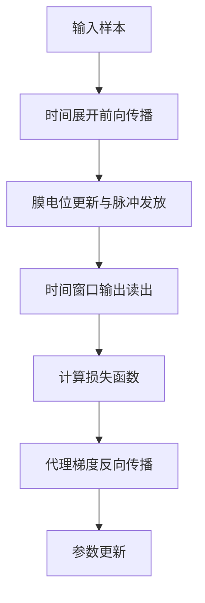
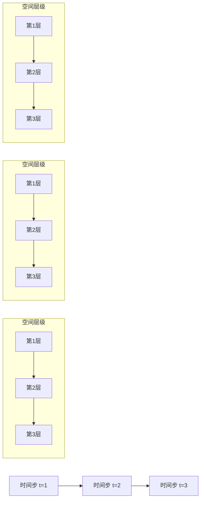
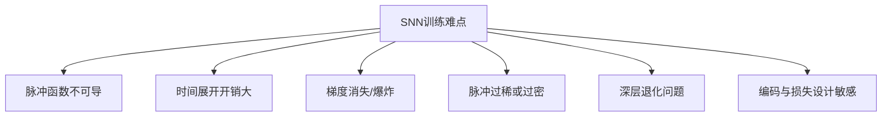

# 2.3 脉冲神经网络训练方法

训练方法是制约脉冲神经网络性能提升与实际应用落地的关键环节之一。与传统人工神经网络不同，SNN 的神经元输出是离散脉冲事件，且其内部状态会在时间维度上持续演化。因此，网络训练不仅涉及空间层级之间的参数依赖，还必须处理由膜电位积累、阈值触发与状态重置共同带来的时间递归关系[1-4]。也就是说，SNN 的优化过程天然同时具有“非光滑”和“强时序”两类特征。前者主要源于脉冲发放函数不可导，后者则体现为当前参数变化会通过神经元状态影响后续多个时间步的响应。正因如此，传统深度神经网络中的标准反向传播方法难以直接照搬到 SNN 训练中，必须围绕脉冲动力学特性构建相应的优化机制。

从已有研究的发展脉络看，SNN 训练方法大致经历了由局部学习规则向可微优化框架逐步演进的过程。早期方法多建立在 Hebb 学习和 STDP（Spike-Timing-Dependent Plasticity）等局部可塑性机制基础之上，这类方法具有较强的生物学合理性，但在复杂监督任务中的性能上限和规模扩展能力相对有限[5-6]。随后，Bohte 等提出 SpikeProp 方法，通过对脉冲发放时间进行可导近似，首次将误差反向传播思想引入多层脉冲神经网络[7]。近年来，随着代理梯度学习、时空反向传播以及深层直接训练方法的不断发展，研究者已经能够在图像分类、目标检测和事件视觉等任务上训练性能较高的深层脉冲网络[1-4][8-10]。基于上述背景，本节将围绕代理梯度训练方法、时空反向传播机制以及训练过程中的典型困难进行系统分析。

## 2.3.1 基于代理梯度的训练方法

### （1）问题来源与基本思想

基于梯度的优化方法之所以能够在传统深度神经网络中取得良好效果，关键在于神经元激活函数通常具有连续可导或分段可导的性质，从而可以利用链式法则稳定地计算损失函数关于各层参数的梯度。然而，在 SNN 中，神经元的脉冲发放通常由 Heaviside 阶跃函数刻画，即

$$
s_i^t=H\left(u_i^t-V_{\mathrm{th}}\right),
$$

其中，$u_i^t$ 表示第 $i$ 个神经元在时刻 $t$ 的膜电位，$V_{\mathrm{th}}$ 表示发放阈值。该函数的真实导数满足

$$
\frac{\partial H(x)}{\partial x}=0,\quad x\neq 0,
$$

并且在 $x=0$ 处不可导。这意味着如果直接使用真实梯度，则在绝大多数区域内梯度都为零，误差信号难以有效传递到前层参数，这正是 SNN 难以直接采用传统反向传播进行训练的根本原因之一[1][2]。

代理梯度（Surrogate Gradient, SG）方法的核心思想是：在前向传播过程中仍保留真实的离散脉冲发放机制，以维持 SNN 的事件驱动特性；而在反向传播过程中，用一个平滑且可导的替代函数近似脉冲函数在阈值附近的梯度，从而使梯度下降方法得以实施[1][2][8]。若记代理梯度函数为 $\phi(\cdot)$，则通常采用如下近似：

$$
\frac{\partial s_i^t}{\partial u_i^t}
\approx
\phi\left(u_i^t-V_{\mathrm{th}}\right).
$$

据此，SNN 的训练过程可以概括为“前向保持脉冲离散性、反向采用连续近似梯度”的双轨计算过程。

### （2）LIF 神经元下的前向传播形式

在采用 LIF 神经元时，网络前向传播通常可写为

$$
x_l^t = W_l s_{l-1}^t + b_l,
$$

$$
u_l^t = \lambda u_l^{t-1} + x_l^t - V_{\mathrm{th}} s_l^{t-1},
$$

$$
s_l^t = H\left(u_l^t - V_{\mathrm{th}}\right),
$$

其中，$W_l$ 和 $b_l$ 分别表示第 $l$ 层的权值和偏置，$\lambda$ 为泄漏因子，$x_l^t$ 为突触输入，$u_l^t$ 为膜电位，$s_l^t$ 为输出脉冲。若输出层采用时间窗口内平均发放率读出，则网络输出可表示为

$$
r_i = \frac{1}{T}\sum_{t=1}^{T}s_{L,i}^t,
$$

其中，$L$ 表示输出层，$T$ 表示仿真时间步长总数。对于分类任务，若目标标签采用 one-hot 编码，则平方误差损失可写为

$$
\mathcal{L}
=\frac{1}{2}\sum_{i=1}^{C}\left(r_i-y_i\right)^2,
$$

其中，$C$ 为类别数，$y_i$ 为目标标签。若采用交叉熵损失，则可先通过时间累积得到输出电位或发放率，再进行 softmax 归一化，即

$$
z_i=\frac{1}{T}\sum_{t=1}^{T}u_{L,i}^t,
$$

$$
\hat{p}_i=\frac{e^{z_i}}{\sum_{j=1}^{C}e^{z_j}},
$$

$$
\mathcal{L}=-\sum_{i=1}^{C} y_i \log \hat{p}_i.
$$

无论采用何种损失函数，其核心都在于求解 $\partial \mathcal{L}/\partial W_l$。由于 $W_l$ 会通过膜电位和脉冲输出在多个时间步上反复影响网络状态，因此梯度计算不能只考虑单一层级的空间依赖，还必须同时纳入时间维度上的递推关系。

### （3）代理梯度下的梯度传播

根据链式法则，第 $l$ 层参数 $W_l$ 的梯度可写为

$$
\frac{\partial \mathcal{L}}{\partial W_l}
=\sum_{t=1}^{T}
\frac{\partial \mathcal{L}}{\partial u_l^t}
\frac{\partial u_l^t}{\partial W_l}.
$$

对于离散 LIF 神经元，有

$$
\frac{\partial u_l^t}{\partial W_l}=s_{l-1}^t,
$$

因此需要进一步求解 $\partial \mathcal{L}/\partial u_l^t$。由膜电位递推关系可得

$$
\frac{\partial \mathcal{L}}{\partial u_l^t}
=
\frac{\partial \mathcal{L}}{\partial s_l^t}
\frac{\partial s_l^t}{\partial u_l^t}
+
\frac{\partial \mathcal{L}}{\partial u_l^{t+1}}
\frac{\partial u_l^{t+1}}{\partial u_l^t}.
$$

在代理梯度近似下，

$$
\frac{\partial s_l^t}{\partial u_l^t}
\approx
\phi\left(u_l^t-V_{\mathrm{th}}\right).
$$

若进一步考虑 $u_l^{t+1}=\lambda u_l^t + \cdots$，则有

$$
\frac{\partial u_l^{t+1}}{\partial u_l^t}\approx \lambda.
$$

于是梯度在时间维度上的传播具有如下递推形式：

$$
\delta_l^t
=
\frac{\partial \mathcal{L}}{\partial u_l^t}
\approx
\frac{\partial \mathcal{L}}{\partial s_l^t}
\phi\left(u_l^t-V_{\mathrm{th}}\right)
+
\lambda \delta_l^{t+1}.
$$

这一递推关系表明，SNN 训练中的误差信号并非只由当前时刻输出决定，还受到后续时间步状态反向影响当前膜电位的作用。也就是说，梯度传播在 SNN 中天然带有明显的时间耦合特征，这也是其训练复杂度高于传统 ANN 的重要原因。

### （4）常见代理梯度函数

代理梯度函数的选择会影响训练稳定性、收敛速度和最终性能。常见代理梯度函数包括矩形函数近似、三角函数近似、Sigmoid 导数近似和快速 Sigmoid 近似等[1][2][8]。例如，矩形近似可写为

$$
\phi_{\mathrm{rect}}(x)=
\begin{cases}
\frac{1}{a}, & |x|<\frac{a}{2},\\
0, & \text{otherwise},
\end{cases}
$$

其中，$a$ 表示近似窗口宽度。三角近似可写为

$$
\phi_{\mathrm{tri}}(x)=
\max\left(0,1-\frac{|x|}{a}\right).
$$

Sigmoid 导数近似可写为

$$
\phi_{\mathrm{sig}}(x)
=\sigma(\alpha x)\left[1-\sigma(\alpha x)\right]\alpha,
$$

其中

$$
\sigma(x)=\frac{1}{1+e^{-x}},
$$

$\alpha$ 为控制斜率的超参数。快速 Sigmoid 近似常写为

$$
\phi_{\mathrm{fast}}(x)=\frac{1}{(1+\alpha |x|)^2}.
$$

尽管不同代理函数的具体表达形式存在差异，但其共同目标都是在阈值附近构造非零梯度区间，以缓解误差传播中出现的梯度衰减问题。已有研究表明，与代理函数的精确形状相比，其非零支撑范围以及梯度尺度往往对训练效果产生更直接的影响[1][2]。

### （5）代理梯度训练流程

如图 2-1 所示，基于代理梯度的训练流程可以概括为时间展开前向传播、损失计算以及代理梯度反向传播三个关键阶段。

图 2-1 基于代理梯度的 SNN 训练流程示意图

总体而言，代理梯度方法通过在前向阶段保留真实脉冲行为、在反向阶段引入可导近似的方式，有效缓解了 SNN 中脉冲函数不可导所带来的训练障碍，已成为当前直接训练深层 SNN 的主流技术路线之一。该方法实现相对简洁，与现有深度学习框架兼容性较好，但其训练效率和稳定性仍然受到时间展开长度、代理函数选择以及网络深度等因素的共同影响。

## 2.3.2 时空反向传播机制

### （1）时空耦合训练问题

脉冲神经网络与传统前馈网络的根本差异之一在于，网络状态不仅沿空间层级传播，还会沿时间维度递归演化。因此，在训练过程中，误差信号必须同时跨越“层间依赖”和“时间依赖”两个方向进行传播。Wu 等提出的时空反向传播（Spatio-Temporal Backpropagation, STBP）方法，正是围绕这一特点建立起来的统一训练框架[3]。其核心思想是将 SNN 在时间维度上展开，将其等价看作一个参数共享的时序深层网络，并在空间域与时间域上联合执行反向传播。

若将网络在 $T$ 个时间步上展开，则一个包含 $L$ 层神经元的 SNN 可等价表示为一个深度约为 $L\times T$ 的计算图。此时损失函数可写为

$$
\mathcal{L}
=\sum_{t=1}^{T}\mathcal{L}^t
\quad \text{or} \quad
\mathcal{L}=\mathcal{L}\left(\{s_L^1,s_L^2,\dots,s_L^T\}\right),
$$

其中，$\mathcal{L}^t$ 表示第 $t$ 个时间步的局部损失，或者整体损失由整个时间窗口内的输出共同决定。

### （2）空间域与时间域误差分解

在 STBP 框架下，第 $l$ 层第 $t$ 个时间步的膜电位误差信号可表示为

$$
\delta_l^t=\frac{\partial \mathcal{L}}{\partial u_l^t}.
$$

该误差信号主要包含两部分来源：一部分来自空间层级上的后续层传播，另一部分来自时间维度上的后续时刻传播。因此可将其写为

$$
\delta_l^t
=
\underbrace{
\frac{\partial \mathcal{L}}{\partial s_l^t}
\frac{\partial s_l^t}{\partial u_l^t}
}_{\text{空间域误差项}}
+
\underbrace{
\frac{\partial \mathcal{L}}{\partial u_l^{t+1}}
\frac{\partial u_l^{t+1}}{\partial u_l^t}
}_{\text{时间域误差项}}.
$$

若考虑后一层神经元的输入关系 $x_{l+1}^t=W_{l+1}s_l^t+b_{l+1}$，则空间域误差项进一步可写为

$$
\frac{\partial \mathcal{L}}{\partial s_l^t}
=
\left(W_{l+1}\right)^{\top}
\frac{\partial \mathcal{L}}{\partial x_{l+1}^t}.
$$

又由于

$$
\frac{\partial s_l^t}{\partial u_l^t}
\approx
\phi\left(u_l^t-V_{\mathrm{th}}\right),
$$

因此空间域梯度传播与传统 ANN 中层间反向传播形式相似，但额外受到代理梯度函数调制。另一方面，对于离散 LIF 神经元，时间域误差项通常具有如下递推关系：

$$
\frac{\partial u_l^{t+1}}{\partial u_l^t}
=
\lambda - V_{\mathrm{th}}\frac{\partial s_l^t}{\partial u_l^t}
\approx
\lambda - V_{\mathrm{th}}\phi\left(u_l^t-V_{\mathrm{th}}\right).
$$

因此，完整的时空误差递推可近似写为

$$
\delta_l^t
=
\left(W_{l+1}^{\top}\delta_{l+1}^t\right)\phi\left(u_l^t-V_{\mathrm{th}}\right)
+
\delta_l^{t+1}
\left[\lambda - V_{\mathrm{th}}\phi\left(u_l^t-V_{\mathrm{th}}\right)\right].
$$

该式表明，在 SNN 中，同一时刻的梯度既受后续层误差影响，也受后一时刻状态误差影响，因此其训练本质上是一个典型的时空耦合动态优化问题。

### （3）参数梯度计算

在时空展开图中，共享参数 $W_l$ 会在每个时间步被重复使用，因此其梯度需要在全部时间步上累积，即

$$
\frac{\partial \mathcal{L}}{\partial W_l}
=
\sum_{t=1}^{T}
\frac{\partial \mathcal{L}}{\partial x_l^t}
\frac{\partial x_l^t}{\partial W_l}.
$$

由于

$$
x_l^t=W_l s_{l-1}^t+b_l,
$$

可得

$$
\frac{\partial x_l^t}{\partial W_l}=s_{l-1}^t,
$$

因此

$$
\frac{\partial \mathcal{L}}{\partial W_l}
=
\sum_{t=1}^{T}
\delta_l^t \left(s_{l-1}^t\right)^{\top}.
$$

偏置项梯度则为

$$
\frac{\partial \mathcal{L}}{\partial b_l}
=
\sum_{t=1}^{T}\delta_l^t.
$$

这说明，SNN 中的参数更新并不是针对单个时刻独立完成的，而是在整个时间窗口范围内对各时间步梯度进行累积后统一完成。该过程与循环神经网络中的 BPTT 在形式上具有较强相似性，但由于 SNN 额外包含阈值触发与状态重置等非线性机制，其训练过程通常更为复杂。

### （4）时空反向传播的优势与局限

STBP 的突出优势在于能够显式建模脉冲神经网络的时空动力学，并借助统一梯度框架直接优化深层 SNN 参数[3][4][9]。在大量静态视觉和事件视觉任务中，该方法已经证明具有良好的有效性。然而，STBP 也伴随着明显代价，即需要保存多个时间步上的膜电位、脉冲状态和中间激活，从而带来较高的时间与存储开销。若网络深度为 $L$，时间步长为 $T$，则训练复杂度通常可近似表示为

$$
\mathcal{O}(LT),
$$

而显存或内存开销同样会随时间步长近似线性增长。这也是当前大量研究尝试采用截断 BPTT、局部误差传播或事件驱动反向传播等方式提升 SNN 训练效率的重要原因[10-12]。

如图 2-2 所示，时空反向传播的核心在于同时考虑空间层级展开与时间序列展开两种梯度路径。

图 2-2 时空反向传播机制示意图

## 2.3.3 常见训练难点分析

尽管代理梯度与时空反向传播已经为深层 SNN 的直接训练奠定了技术基础，但与传统 ANN 相比，SNN 在实际优化过程中仍然面临更复杂的训练困难。这些困难不仅源于脉冲发放函数不可导，还与时间展开带来的长梯度路径、多重状态依赖关系以及更高的计算资源需求密切相关。综合现有研究，SNN 训练中的典型难点主要体现在以下几个方面。

### （1）梯度消失与梯度爆炸

由于误差信号需要同时沿时间维度和空间层级传播，SNN 的梯度链条通常比传统前馈网络更长。若将某层从时刻 $t$ 到时刻 $t+k$ 的时间域梯度链写为

$$
\frac{\partial u^{t+k}}{\partial u^t}
=
\prod_{\tau=t}^{t+k-1}
\frac{\partial u^{\tau+1}}{\partial u^\tau},
$$

当各项导数绝对值长期小于 1 时，易出现

$$
\left|
\frac{\partial u^{t+k}}{\partial u^t}
\right|\rightarrow 0,
$$

即梯度消失；反之，当某些导数项绝对值持续大于 1 时，则可能导致

$$
\left|
\frac{\partial u^{t+k}}{\partial u^t}
\right|\rightarrow \infty,
$$

即梯度爆炸。由于 SNN 中还叠加了代理梯度函数 $\phi(\cdot)$ 的调制作用，因此其梯度分布对阈值设定、膜时间常数、代理函数尺度以及时间步长度尤为敏感[1-4]。

### （2）时间展开导致的训练开销较大

在直接训练 SNN 时，通常需要沿时间维度展开整个网络，并保存各时间步的膜电位、脉冲输出和中间状态，以便后续执行反向传播。这使得训练开销随着时间步长度增加而显著上升。若单个时间步的前向计算复杂度为 $\mathcal{C}$，则完整时间窗口的前向复杂度近似为

$$
\mathcal{C}_{\mathrm{forward}} \approx T\mathcal{C},
$$

而反向传播通常具有同量级或更高开销，因此总体训练复杂度可表示为

$$
\mathcal{C}_{\mathrm{train}} \approx \mathcal{O}(T\mathcal{C}).
$$

同时，状态存储开销也近似满足

$$
\mathcal{M}_{\mathrm{train}} \propto T \sum_{l=1}^{L} n_l,
$$

其中，$n_l$ 表示第 $l$ 层神经元数目。由此不难看出，当网络层数较深、时间步较长时，SNN 的训练往往会面临较大的时间与显存压力[3][9-12]。

### （3）脉冲稀疏性与有效梯度不足

脉冲神经网络的一个重要特征是脉冲活动具有稀疏性。然而，从训练角度看，过强的稀疏性也可能导致有效梯度不足。若某层在时间窗口内的平均发放率过低，即

$$
\rho_l=\frac{1}{T N_l}\sum_{t=1}^{T}\sum_{i=1}^{N_l}s_{l,i}^t \approx 0,
$$

其中，$N_l$ 为第 $l$ 层神经元个数，则该层大部分神经元在大多数时间步保持静默状态。由于脉冲事件过少，后续层接收到的有效信息有限，反向传播时可用于更新参数的误差信号也会相应减弱，从而导致训练停滞或收敛缓慢。相反，若脉冲活动过于密集，即

$$
\rho_l \approx 1,
$$

则会削弱 SNN 的事件驱动优势，并可能造成网络退化为近似连续激活系统。因此，如何在保证可训练性的同时维持适度脉冲稀疏性，是 SNN 训练中的重要平衡问题。

### （4）深层网络退化与训练稳定性不足

随着网络深度增加，SNN 还可能出现更明显的性能退化问题。一方面，深层网络中的梯度传输路径进一步拉长，前层神经元更容易受到梯度衰减影响；另一方面，膜电位在多层和多时间步传递后，其分布更容易偏离合理范围，进而导致部分层长期处于“几乎不发放”或“过度发放”状态。若记第 $l$ 层膜电位均值为

$$
\bar{u}_l = \frac{1}{TN_l}\sum_{t=1}^{T}\sum_{i=1}^{N_l}u_{l,i}^t,
$$

则当

$$
\bar{u}_l \ll V_{\mathrm{th}}
\quad \text{or} \quad
\bar{u}_l \gg V_{\mathrm{th}},
$$

都可能导致该层脉冲活动分布失衡，从而影响训练稳定性。为缓解这一问题，研究者通常引入膜电位归一化、时序批归一化、残差连接以及可学习神经元参数等机制，以改善深层 SNN 的可训练性[4][9][13]。

### （5）输入编码与损失设计对训练效果影响显著

SNN 的训练效果不仅取决于优化算法本身，还与输入编码方式和输出损失构造密切相关。若采用频率编码，则训练目标往往更倾向于优化时间窗口内的平均发放率；若采用时间编码，则训练过程更关注首次脉冲时刻或发放顺序等时序结构。设输出目标为发放率形式时，损失可写为

$$
\mathcal{L}_{\mathrm{rate}}
=\frac{1}{2}\sum_i (r_i-y_i)^2;
$$

若输出目标为目标发放时刻 $t_i^{\mathrm{tar}}$，则可构造时间误差损失

$$
\mathcal{L}_{\mathrm{time}}
=\frac{1}{2}\sum_i \left(t_i^{*}-t_i^{\mathrm{tar}}\right)^2.
$$

不同损失函数对网络优化方向和训练稳定性的影响往往差异较大。因此，在实际任务中，需要结合输入表示形式、网络输出读出方式和评价指标综合设计训练目标，而不能简单沿用传统 ANN 的标准损失构造。

如图 2-3 所示，SNN 训练中的主要困难并不是孤立存在的，而是往往相互耦合、共同影响训练过程。

图 2-3 SNN 常见训练难点示意图

综合而言，SNN 训练的复杂性主要来源于脉冲发放的非光滑性、神经元状态的时间递归性以及训练目标与编码机制之间的紧密耦合。代理梯度和时空反向传播为深层 SNN 的直接训练提供了可行路径，但在网络持续加深、时间步不断拉长以及任务复杂度提升的背景下，训练稳定性、资源消耗与优化效率问题依然十分突出。这些问题也是当前脉冲神经网络研究持续改进训练策略、设计更高效优化框架的重要动因。

## 参考文献

[1] NEFTCI E O, MOSTAFA H, ZENKE F. Surrogate gradient learning in spiking neural networks: bringing the power of gradient-based optimization to spiking neural networks[J]. IEEE Signal Processing Magazine, 2019, 36(6): 51-63.

[2] ZENKE F, GANGULI S. SuperSpike: supervised learning in multilayer spiking neural networks[J]. Neural Computation, 2018, 30(6): 1514-1541.

[3] WU Y, DENG L, LI G, et al. Spatio-temporal backpropagation for training high-performance spiking neural networks[J]. Frontiers in Neuroscience, 2018, 12: 331.

[4] ROY K, JAISWAL A, PANDA P. Towards spike-based machine intelligence with neuromorphic computing[J]. Nature, 2019, 575(7784): 607-617.

[5] BI G Q, POO M M. Synaptic modifications in cultured hippocampal neurons: dependence on spike timing, synaptic strength, and postsynaptic cell type[J]. Journal of Neuroscience, 1998, 18(24): 10464-10472.

[6] SONG S, MILLER K D, ABBOTT L F. Competitive Hebbian learning through spike-timing-dependent synaptic plasticity[J]. Nature Neuroscience, 2000, 3(9): 919-926.

[7] BOHTE S M, KOK J N, LA POUTRE H. Error-backpropagation in temporally encoded networks of spiking neurons[J]. Neurocomputing, 2002, 48(1-4): 17-37.

[8] SHRESTHA S B, ORCHARD G. SLAYER: spike layer error reassignment in time[C]// Advances in Neural Information Processing Systems. 2018: 1412-1421.

[9] FANG W, YU Z, CHEN Y, et al. Deep residual learning in spiking neural networks[C]// Advances in Neural Information Processing Systems. 2021, 34: 21056-21069.

[10] YIN B, CORREIA M V, SEYBOLD B, et al. Efficient training of spiking neural networks with temporally-truncated local backpropagation through time[J]. Frontiers in Neuroscience, 2023, 17: 1047008.

[11] WUNDERLICH T C, PEHLE C. EventProp: event-based backpropagation for exact gradients in spiking neural networks[J]. Nature Communications, 2021, 12: 2148.

[12] SHI Y, LIANG D, HAN X, et al. Efficient training through time for spiking neural networks by backpropagation with temporal efficient training[J]. Frontiers in Neuroscience, 2022, 16: 760298.

[13] DUAN C, DING J, CHEN S, et al. Temporal effective batch normalization in spiking neural networks[C]// Advances in Neural Information Processing Systems. 2022, 35: 34377-34390.
