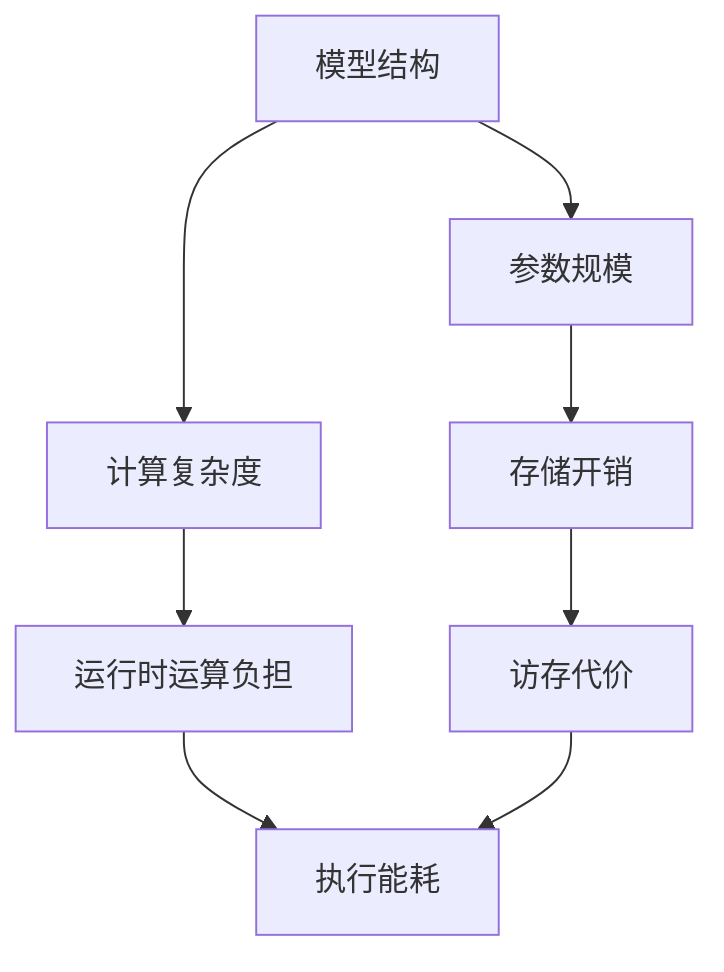
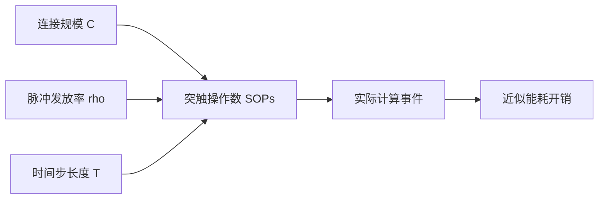
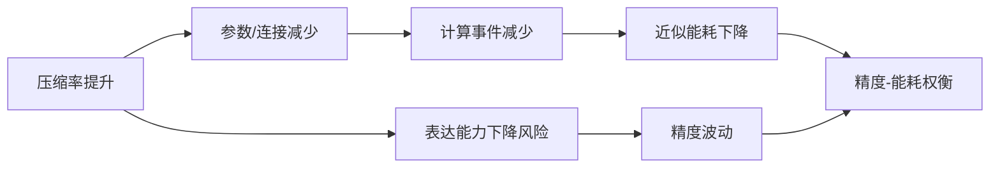

# 2.5 面向能耗优化的模型压缩理论基础

面向能耗优化的模型压缩，本质上是在模型性能、结构规模、运行开销与部署约束之间寻求更合理的平衡。对于传统深度神经网络而言，参数规模、浮点运算量、访存行为和硬件执行方式共同决定模型的实际能耗；对于脉冲神经网络而言，除参数规模外，脉冲活动稀疏性、时间步展开长度以及突触事件数量同样会显著影响系统能耗表现[1-5]。因此，若希望从“结构压缩”进一步走向“能耗优化”，就不能仅停留在参数减少这一单一目标上，而需要同时关注计算复杂度、神经元激活行为以及精度保持之间的耦合关系。

需要说明的是，模型压缩与能耗优化之间并非简单的一一对应关系。一个模型在参数量上变小，并不必然意味着其在真实平台上运行更省电；反之，若压缩策略能够有效减少关键计算路径上的冗余结构、降低激活密度或缩短时间展开过程，则往往能够带来更直接的能耗收益[2][4][6]。正因如此，面向能耗优化的模型压缩研究，需要在理论层面明确三个基本问题：其一，模型参数规模与计算复杂度如何刻画；其二，脉冲活动稀疏性如何影响实际计算事件与能量消耗；其三，在给定压缩目标下，模型精度与能耗之间如何形成权衡关系。本节将围绕上述问题展开分析，为后续剪枝方法设计与能耗评价指标构建提供理论基础。

## 2.5.1 参数规模与计算复杂度分析

模型压缩研究首先需要回答的问题是：网络的“复杂度”究竟如何刻画。通常而言，最常见的量化维度包括参数量（Parameters）、计算量（FLOPs 或 SOPs）、存储开销以及实际运行延迟。其中，参数量反映模型静态规模，计算量反映推理阶段的运算负担，而二者共同影响存储需求、带宽占用和能耗水平[2][6-8]。

### （1）参数规模描述

对于卷积层，设输入通道数为 $C_{\mathrm{in}}$，输出通道数为 $C_{\mathrm{out}}$，卷积核尺寸为 $K\times K$，则其参数量可表示为

$$
P_{\mathrm{conv}} = C_{\mathrm{out}} \times C_{\mathrm{in}} \times K^2,
$$

若考虑偏置项，则有

$$
P_{\mathrm{conv}}^{\prime} = C_{\mathrm{out}} \times C_{\mathrm{in}} \times K^2 + C_{\mathrm{out}}.
$$

对于全连接层，若输入维度为 $N_{\mathrm{in}}$，输出维度为 $N_{\mathrm{out}}$，则参数量为

$$
P_{\mathrm{fc}} = N_{\mathrm{in}} \times N_{\mathrm{out}},
$$

考虑偏置时可写为

$$
P_{\mathrm{fc}}^{\prime} = N_{\mathrm{in}} \times N_{\mathrm{out}} + N_{\mathrm{out}}.
$$

若一个网络包含 $L$ 个可训练层，则总参数量可写为

$$
P_{\mathrm{all}} = \sum_{l=1}^{L} P_l.
$$

若剪枝后网络参数量变为 $\tilde{P}_{\mathrm{all}}$，则参数压缩率定义为

$$
\eta_P = 1-\frac{\tilde{P}_{\mathrm{all}}}{P_{\mathrm{all}}},
$$

而参数保留率可写为

$$
\rho_P = \frac{\tilde{P}_{\mathrm{all}}}{P_{\mathrm{all}}}.
$$

参数量是模型压缩中最直观的静态指标，它直接影响模型文件大小、权值存储需求和部分访存代价。然而，仅依赖参数量并不足以完整刻画模型的真实运行开销，因为不同层的参数在推理时被调用的频率并不一致，不同硬件平台对存储访问的代价也存在显著差异[3][6]。

### （2）计算复杂度描述

在传统 ANN 中，计算复杂度通常用浮点运算次数（Floating Point Operations, FLOPs）衡量。对于卷积层，若输出特征图尺寸为 $H_{\mathrm{out}}\times W_{\mathrm{out}}$，则其 FLOPs 近似为

$$
F_{\mathrm{conv}} =
2 \times C_{\mathrm{out}} \times C_{\mathrm{in}} \times K^2 \times H_{\mathrm{out}} \times W_{\mathrm{out}},
$$

其中系数 2 表示乘法与加法操作的共同计数。对于全连接层，有

$$
F_{\mathrm{fc}} = 2 \times N_{\mathrm{in}} \times N_{\mathrm{out}}.
$$

于是，整个网络的总 FLOPs 可写为

$$
F_{\mathrm{all}} = \sum_{l=1}^{L} F_l.
$$

剪枝后对应的计算压缩率为

$$
\eta_F = 1-\frac{\tilde{F}_{\mathrm{all}}}{F_{\mathrm{all}}}.
$$

从理论上看，参数压缩率和 FLOPs 压缩率通常并不完全一致。对于同样的参数削减，不同层对计算复杂度的贡献差异可能非常大。例如，靠近输入端的卷积层即使参数量不大，但由于特征图尺寸较大，其 FLOPs 占比可能很高；而靠近输出端的全连接层参数量较大，但实际计算量未必同等突出。因此，若压缩目标指向真实运行开销优化，仅用参数量作为唯一评价标准往往是不充分的。

### （3）剪枝对复杂度的影响

从结构压缩角度看，剪枝可以视作对网络宽度、连接拓扑或层内有效计算路径的缩减。若以通道剪枝为例，设剪枝前某卷积层输入输出通道数分别为 $C_{\mathrm{in}}$ 和 $C_{\mathrm{out}}$，剪枝后变为 $\tilde{C}_{\mathrm{in}}$ 和 $\tilde{C}_{\mathrm{out}}$，则其参数量与计算量可分别变化为

$$
\tilde{P}_{\mathrm{conv}} = \tilde{C}_{\mathrm{out}} \times \tilde{C}_{\mathrm{in}} \times K^2,
$$

$$
\tilde{F}_{\mathrm{conv}} =
2 \times \tilde{C}_{\mathrm{out}} \times \tilde{C}_{\mathrm{in}} \times K^2 \times H_{\mathrm{out}} \times W_{\mathrm{out}}.
$$

若定义该层输入、输出通道保留率分别为

$$
\rho_{\mathrm{in}}=\frac{\tilde{C}_{\mathrm{in}}}{C_{\mathrm{in}}},
\qquad
\rho_{\mathrm{out}}=\frac{\tilde{C}_{\mathrm{out}}}{C_{\mathrm{out}}},
$$

则该层参数保留率和计算保留率都可近似表示为

$$
\rho_{\mathrm{conv}} \approx \rho_{\mathrm{in}} \rho_{\mathrm{out}}.
$$

由此可见，结构化通道剪枝对复杂度的影响具有乘性特征，因此对关键层进行适度压缩往往可以带来较明显的复杂度下降。

图 2-7 给出了参数规模与计算复杂度关系的概念示意。

图 2-7 参数规模与计算复杂度关系示意图

综合来看，参数量和计算复杂度共同构成了模型压缩分析的基本起点。前者更偏向静态规模刻画，后者更接近运行过程中的运算负担。在面向能耗优化的研究中，这两类指标虽然不能直接等价为真实能耗，但它们为分析压缩行为对系统开销的影响提供了必要基础。

## 2.5.2 脉冲活动稀疏性与能耗关系

与传统人工神经网络相比，脉冲神经网络在能耗层面最大的差异，并不只在于参数规模，而在于其事件驱动的计算方式。对于 ANN 而言，只要执行一次前向传播，大量乘加运算就会被完整触发；而对于 SNN 而言，只有当神经元发放脉冲时，相关突触事件才会真正发生，因而网络中的实际计算量与脉冲活动强弱直接相关[1][4][5]。这也是 SNN 被认为具有低功耗潜力的重要原因。

### （1）脉冲稀疏性基本描述

设第 $l$ 层共有 $N_l$ 个神经元，仿真时间窗口长度为 $T$，第 $i$ 个神经元在时刻 $t$ 的脉冲输出记为 $s_{l,i}^t\in\{0,1\}$，则该层平均脉冲发放率可定义为

$$
\rho_l = \frac{1}{T N_l}\sum_{t=1}^{T}\sum_{i=1}^{N_l}s_{l,i}^t.
$$

若以单个通道为单位，则第 $c$ 个通道的平均脉冲率可写为

$$
\rho_{l,c} = \frac{1}{T N_{l,c}}\sum_{t=1}^{T}\sum_{i=1}^{N_{l,c}} s_{l,c,i}^t,
$$

其中，$N_{l,c}$ 表示该通道内神经元数目。该指标反映了某层或某通道在整个推理过程中参与事件驱动计算的活跃程度。一般而言，$\rho_l$ 越小，表示该层脉冲活动越稀疏；$\rho_l$ 越大，则说明该层在更频繁地触发突触事件。

### （2）突触操作数与脉冲事件

在神经形态计算语境下，SNN 的计算开销常用突触操作数（Synaptic Operations, SOPs）或突触事件数来近似描述。设第 $l$ 层的有效连接数为 $C_l$，上一层平均脉冲率为 $\rho_{l-1}$，则该层在单个时间步上的有效突触操作数可近似表示为

$$
\mathrm{SOP}_l^t \approx \rho_{l-1}^t \cdot C_l.
$$

若在整个时间窗口内进行累积，则有

$$
\mathrm{SOPs}_l \approx \sum_{t=1}^{T}\rho_{l-1}^t C_l.
$$

对整个网络而言，总突触操作数可写为

$$
\mathrm{SOPs}_{\mathrm{all}}
\approx
\sum_{l=1}^{L}\sum_{t=1}^{T}\rho_{l-1}^t C_l.
$$

若进一步近似假设各层在时间窗口内平均脉冲率相对稳定，即 $\rho_{l-1}^t \approx \bar{\rho}_{l-1}$，则可得

$$
\mathrm{SOPs}_{\mathrm{all}}
\approx
T\sum_{l=1}^{L}\bar{\rho}_{l-1} C_l.
$$

该表达式直观表明：SNN 的实际运行开销不仅取决于连接规模 $C_l$，还与脉冲活动水平 $\bar{\rho}_{l-1}$ 密切相关。即便网络结构不变，若脉冲发放更稀疏，系统实际触发的突触操作数也会显著下降。

### （3）计算事件与能量消耗的关系

在硬件实现层面，能耗通常可近似表示为不同类型操作的加权和。设一次乘加操作能耗为 $E_{\mathrm{MAC}}$，一次累加操作能耗为 $E_{\mathrm{AC}}$，存储访问能耗为 $E_{\mathrm{mem}}$，则一个简化的系统能耗模型可写为

$$
E_{\mathrm{all}}
\approx
N_{\mathrm{MAC}}E_{\mathrm{MAC}}
+
N_{\mathrm{AC}}E_{\mathrm{AC}}
+
N_{\mathrm{mem}}E_{\mathrm{mem}},
$$

其中，$N_{\mathrm{MAC}}$、$N_{\mathrm{AC}}$ 和 $N_{\mathrm{mem}}$ 分别表示乘加操作次数、累加操作次数和存储访问次数。对于传统 ANN，卷积与全连接计算通常依赖大量 MAC 操作；对于事件驱动 SNN，在神经形态硬件上，更常见的是在脉冲触发下执行 AC 操作，因此其理论能耗优势通常来源于两方面：一是 AC 相较 MAC 的单次能量代价更低，二是脉冲稀疏性使得实际触发次数显著减少[1][3][5][9]。

若以突触操作数近似主导计算能耗，则 SNN 的能耗可进一步写为

$$
E_{\mathrm{SNN}}
\approx
\mathrm{SOPs}_{\mathrm{all}} \cdot E_{\mathrm{AC}} + E_{\mathrm{mem}}.
$$

若将上一式与 SOPs 表达式结合，则有

$$
E_{\mathrm{SNN}}
\approx
E_{\mathrm{AC}}
\sum_{l=1}^{L}\sum_{t=1}^{T}\rho_{l-1}^t C_l
+
E_{\mathrm{mem}}.
$$

这说明，在 SNN 中，连接数减少和脉冲率下降都会通过降低突触事件数量而间接降低能耗。也正因为如此，剪枝方法如果能够在保持精度的同时削减冗余连接，并抑制不必要的脉冲传播，通常就具备实现能耗相关指标改善的潜力。

### （4）时间步长度的影响

除结构规模和脉冲率外，时间步长度 $T$ 也是影响 SNN 运行开销的重要因素。若在平均脉冲率不变的条件下增加时间步，则总突触操作数近似随 $T$ 线性增长，即

$$
\mathrm{SOPs}_{\mathrm{all}} \propto T.
$$

相应地，能耗近似也满足

$$
E_{\mathrm{SNN}} \propto T.
$$

这一点对 SNN 研究具有重要启示：低功耗并不是 SNN 的天然结果，而是在稀疏脉冲活动、合理时间步设置与高效结构设计共同作用下才能显现的综合属性。若模型为了追求精度而使用过长时间展开，即使单步计算较稀疏，累积后的总体开销也可能相当可观。

图 2-8 给出了脉冲稀疏性与能耗关系的概念示意。

图 2-8 脉冲稀疏性与能耗关系示意图

总体来看，脉冲活动稀疏性为 SNN 的能耗优化提供了区别于传统 ANN 的独特路径。对于后续研究而言，若能够在结构压缩的基础上进一步降低无效脉冲传播，就有望在参数压缩之外获得额外的能耗收益。这一理论联系，也是后续分析通道剪枝与脉冲活动变化之间关系的重要依据。

## 2.5.3 精度与能耗权衡机制

在模型压缩研究中，精度保持与资源优化之间通常存在天然矛盾。压缩强度不足时，模型仍保留大量冗余结构，能耗改善有限；压缩过强时，模型表达能力下降，又会引发显著精度损失。对于脉冲神经网络而言，这一矛盾还会进一步受到脉冲稀疏性、时间步长度和网络动态行为的共同影响。因此，“精度 - 能耗”权衡是面向能耗优化模型压缩研究必须面对的核心问题之一。

### （1）精度与压缩率之间的关系

设原始模型精度为 $A_0$，压缩后模型精度为 $A$，则精度保持率可写为

$$
\rho_A = \frac{A}{A_0},
$$

精度下降量可表示为

$$
\Delta A = A_0 - A.
$$

若以参数压缩率 $\eta_P$ 或计算压缩率 $\eta_F$ 作为压缩强度度量，则一般可将精度变化近似表示为

$$
A = \Psi(\eta_P)
\quad \text{or} \quad
A = \Psi(\eta_F),
$$

其中，$\Psi(\cdot)$ 通常为随压缩率增加而单调下降的函数。实际中，在较低压缩区间内，模型可能表现出一定冗余容忍性，即精度下降较缓；而当压缩率超过某一临界点后，精度往往会快速衰减。这也意味着合理的压缩策略往往并不是追求最大压缩率，而是在可接受精度损失范围内获得尽可能大的资源收益。

### （2）精度与能耗之间的多目标关系

若以 $E$ 表示模型近似能耗，$A$ 表示模型精度，则面向能耗优化的压缩过程可理解为一个多目标优化问题：

$$
\max A,\qquad \min E.
$$

更常见的写法是将二者统一为单目标加权形式：

$$
\min_{W,M}\ \mathcal{L}(W\odot M) + \lambda \mathcal{R}_E(W,M),
$$

其中，$\mathcal{R}_E(\cdot)$ 为与能耗相关的正则项或代理项。由于实际研究中常难以直接得到精确硬件能耗，因此也可使用参数量、FLOPs、SOPs 或连接率等指标作为近似约束，即

$$
\mathcal{R}_E(W,M) \approx \alpha P + \beta F + \gamma \mathrm{SOPs}.
$$

若将精度和能耗视为两个互相制约的指标，则所有可行压缩方案通常会形成一条近似的 Pareto 前沿。设方案集合为 $\mathcal{S}$，则 Pareto 最优条件可写为：对任意方案 $s_i\in\mathcal{S}$，不存在另一方案 $s_j$ 满足

$$
A(s_j)\geq A(s_i),
\qquad
E(s_j)\leq E(s_i),
$$

且至少有一个不等式严格成立。该定义说明：在精度与能耗共同优化的场景下，最优方案往往并不是某个单一极值，而是一组代表不同权衡关系的非支配解。

### （3）压缩收益与性能损失的平衡指标

为了定量描述压缩收益与性能损失之间的平衡，研究中常引入综合评价指标。若参数压缩率为 $\eta_P$，能耗改善比例为 $\eta_E$，精度下降量为 $\Delta A$，则可构造简单的综合效益指标

$$
\Gamma
=
\frac{\omega_1 \eta_P + \omega_2 \eta_E}{\Delta A + \epsilon},
$$

其中，$\omega_1$ 与 $\omega_2$ 为压缩收益权重，$\epsilon$ 为防止分母为零的微小常数。该式体现出“在精度损失尽量小的前提下获得尽可能大的压缩和能耗收益”的基本思想。

若更强调能耗因素，也可定义单位精度损失对应的能耗收益为

$$
\Gamma_E
=
\frac{\eta_E}{\Delta A + \epsilon}.
$$

尽管这些指标并不一定直接用于训练优化，但它们有助于在实验分析阶段比较不同压缩方案的综合表现。

### （4）脉冲网络中的权衡特殊性

对于 SNN 而言，精度与能耗之间的权衡还具有一些不同于 ANN 的特殊性。首先，SNN 的脉冲活动水平本身会影响模型表达能力。若通过过强约束使脉冲率过低，则网络可能因有效信息传播不足而导致精度下降；若脉冲率过高，又会削弱事件驱动优势并推高运行开销。设第 $l$ 层平均脉冲率为 $\rho_l$，则可将网络整体脉冲活动水平写为

$$
\bar{\rho}
=
\frac{1}{L}\sum_{l=1}^{L}\rho_l.
$$

在很多情况下，网络精度可视作 $\bar{\rho}$ 的函数，即

$$
A = \Phi(\bar{\rho}),
$$

其中 $\Phi(\cdot)$ 往往并非单调函数。过低的 $\bar{\rho}$ 可能导致信息表达不足，过高的 $\bar{\rho}$ 又可能带来噪声累积和资源浪费，因此实践中通常需要保持脉冲活动处于适中区间。

其次，结构压缩对深层与浅层的影响并不相同。若定义第 $l$ 层压缩率为 $\eta_l$，则模型整体精度下降量可近似看作各层扰动的非线性组合：

$$
\Delta A \approx \Omega(\eta_1,\eta_2,\dots,\eta_L).
$$

其中，$\Omega(\cdot)$ 并非简单线性叠加函数。某些关键层即使剪枝比例不高，也可能造成明显性能波动；而某些冗余层即使压缩较强，对整体性能影响仍较有限。这一特点说明，面向能耗优化的压缩不应只关注“压得更多”，还应关注“压在哪里更合适”。

### （5）理论启示

从理论层面看，面向能耗优化的模型压缩并不意味着必须直接对硬件能耗进行精确建模。在很多研究场景下，只要能够建立“结构规模下降 - 脉冲事件减少 - 近似能耗降低”之间的稳定联系，并在实验中通过参数量、连接率、SOPs 或其他能耗相关指标加以验证，就已经具备较强的方法合理性。也就是说，能耗优化可以表现为一种“间接优化”思路：通过降低冗余结构和抑制无效脉冲活动，实现与能耗改善一致的结构行为变化。

图 2-9 给出了精度与能耗权衡关系的概念示意。

图 2-9 精度与能耗权衡机制示意图

综合而言，模型压缩与能耗优化之间的关系，本质上是“结构冗余削减、计算事件压缩与性能保持”三者之间的协同关系。对于后续研究而言，真正有意义的问题并不只是压缩多少，而是如何在可接受精度损失范围内，尽可能减少与能耗密切相关的结构和计算开销。这一认识也为后续围绕通道重要性评估、结构选择与压缩效果分析的研究提供了明确理论出发点。

## 参考文献

[1] ROY K, JAISWAL A, PANDA P. Towards spike-based machine intelligence with neuromorphic computing[J]. Nature, 2019, 575(7784): 607-617.

[2] HAN S, MAO H, DALLY W J. Deep compression: compressing deep neural networks with pruning, trained quantization and Huffman coding[EB/OL]. arXiv:1510.00149, 2015.

[3] HOROWITZ M. 1.1 Computing's energy problem (and what we can do about it)[C]// 2014 IEEE International Solid-State Circuits Conference Digest of Technical Papers. Piscataway: IEEE, 2014: 10-14.

[4] DAVIES M, SRINIVASA N, LIN T H, et al. Loihi: a neuromorphic manycore processor with on-chip learning[J]. IEEE Micro, 2018, 38(1): 82-99.

[5] MEROLLA P A, ARTHUR J V, ALVAREZ-ICAZA R, et al. A million spiking-neuron integrated circuit with a scalable communication network and interface[J]. Science, 2014, 345(6197): 668-673.

[6] YANG T J, HOWARD A, CHEN B, et al. NetAdapt: platform-aware neural network adaptation for mobile applications[C]// Proceedings of the European Conference on Computer Vision. 2018: 285-300.

[7] HE Y, ZHANG X, SUN J. Channel pruning for accelerating very deep neural networks[C]// Proceedings of the IEEE International Conference on Computer Vision. 2017: 1389-1397.

[8] LIU Z, LI J, SHEN Z, et al. Learning efficient convolutional networks through network slimming[C]// Proceedings of the IEEE International Conference on Computer Vision. 2017: 2736-2744.

[9] RUECKAUER B, LU Y, LIU S C, et al. Conversion of continuous-valued deep networks to efficient event-driven networks for image classification[J]. Frontiers in Neuroscience, 2017, 11: 682.
