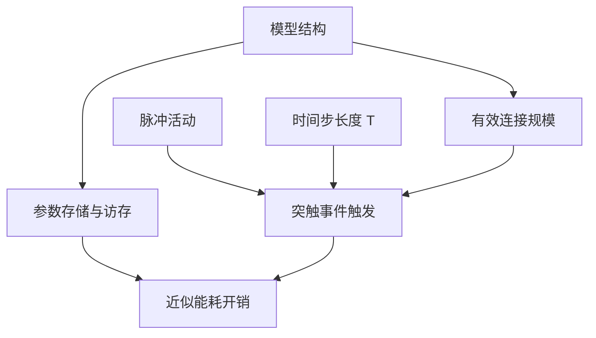
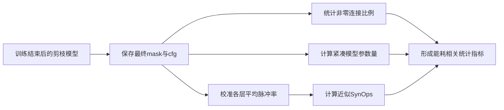
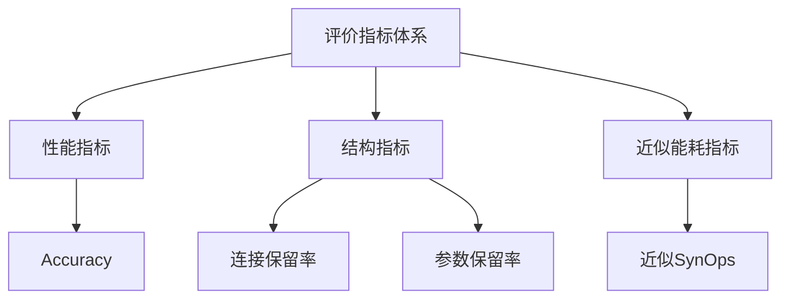

# 2.6 脉冲神经网络近似能耗分析与评价指标

在面向能耗优化的脉冲神经网络研究中，建立合理而可操作的评价口径，是连接理论分析与实验验证的关键环节。理想情况下，若能够在具体神经形态芯片或目标硬件平台上直接测得功耗、能量与时延，则可以对模型压缩效果作出最直观判断。然而，在多数算法研究场景中，真实硬件环境、底层驱动条件和平台测量接口并不总是具备，因而难以对每一种压缩模型进行严格的芯片级能耗实测[1-4]。在此背景下，研究者通常采用“近似能耗分析”的思路，以若干能够反映结构规模和事件驱动计算负担的代理指标，对模型压缩带来的潜在能耗变化进行间接刻画。

对于本文所研究的脉冲神经网络剪枝问题而言，这种近似分析口径具有较强合理性。其原因在于：一方面，结构化剪枝会直接减少模型中的有效连接与参数规模；另一方面，脉冲活动的变化又会进一步影响推理阶段实际发生的突触事件数量。因此，即使不直接构建严格硬件功耗模型，仍然可以通过连接保留率、紧凑模型参数量、近似突触操作数（SynOps）以及精度变化等指标，从结构规模、事件驱动计算强度和任务性能三个层面，对压缩方法的能耗相关效果进行系统分析。基于这一考虑，本节不再追求严格意义上的芯片级能耗建模，而是围绕“能耗来源分析、近似模型构建与评价指标定义”展开讨论，为后续实验章节中的结果统计与比较提供统一依据。

## 2.6.1 脉冲神经网络能耗来源分析

脉冲神经网络的能耗来源具有明显的系统性特征。从整体计算流程看，模型在推理过程中的能耗主要来自参数存储与访存、神经元状态更新、突触加权累加、脉冲事件传播以及输出读出等多个环节[1][3-5]。若从较高抽象层级进行划分，可将其概括为静态结构相关开销和动态运行相关开销两部分。

### （1）静态结构相关开销

静态结构相关开销主要与模型参数规模和网络拓扑复杂度有关。设网络参数集合为 $W$，则模型总参数量可表示为

$$
P_{\mathrm{all}} = \sum_{l=1}^{L} P_l,
$$

其中，$P_l$ 表示第 $l$ 层参数量。对于卷积层，有

$$
P_{\mathrm{conv}} = C_{\mathrm{out}} C_{\mathrm{in}} K^2,
$$

对于全连接层，有

$$
P_{\mathrm{fc}} = N_{\mathrm{in}} N_{\mathrm{out}}.
$$

参数量越大，模型在存储和加载过程中需要占用的带宽与存储资源通常越高。特别是在边缘设备和嵌入式平台上，存储访问开销在整体能耗中往往占据重要比例，因此结构压缩本身就具有降低静态资源消耗的潜力[2][6]。

### （2）动态运行相关开销

与传统人工神经网络相比，SNN 的动态运行开销更强烈地受到脉冲活动水平影响。设第 $l$ 层共有 $N_l$ 个神经元，仿真时间窗口长度为 $T$，第 $i$ 个神经元在时刻 $t$ 的脉冲输出记为 $s_{l,i}^t \in \{0,1\}$，则该层平均脉冲率可定义为

$$
\rho_l = \frac{1}{T N_l}\sum_{t=1}^{T}\sum_{i=1}^{N_l} s_{l,i}^t.
$$

在事件驱动计算模式下，只有当脉冲真正发生时，相关突触累加和状态更新才会被触发。因此，推理阶段的实际计算事件数与 $\rho_l$ 密切相关。若第 $l$ 层有效连接数记为 $C_l$，则该层在单个时间步上的近似突触操作数可表示为

$$
\mathrm{SOP}_l^t \approx \rho_{l-1}^t C_l.
$$

在整个时间窗口内累积可得

$$
\mathrm{SOPs}_l \approx \sum_{t=1}^{T}\rho_{l-1}^t C_l.
$$

由此可见，SNN 的运行能耗并不只取决于网络结构规模，还与脉冲活动稀疏程度直接相关。换言之，即便网络结构固定，如果模型在推理过程中触发的脉冲事件更少，则系统的动态计算开销通常也会更低。

### （3）时间展开带来的附加开销

除结构规模和脉冲率外，时间步长度 $T$ 同样会显著影响 SNN 的整体运行负担。若平均脉冲率保持不变，则总突触操作数可近似写为

$$
\mathrm{SOPs}_{\mathrm{all}}
\approx
\sum_{l=1}^{L}\sum_{t=1}^{T}\rho_{l-1}^t C_l.
$$

在平均脉冲率相对稳定时，可进一步写为

$$
\mathrm{SOPs}_{\mathrm{all}}
\approx
T \sum_{l=1}^{L}\bar{\rho}_{l-1} C_l,
$$

其中，$\bar{\rho}_{l-1}$ 为第 $l-1$ 层在时间窗口内的平均脉冲率。该式表明，时间步长度在一定程度上对整体计算开销具有线性放大作用。也就是说，SNN 的低功耗潜力并不是由“脉冲网络”这一标签自动保证的，而是依赖于结构规模、脉冲稀疏性与时间展开长度的共同作用。

如图 2-10 所示，脉冲神经网络的能耗来源并非由单一因素决定，而是由结构规模、脉冲活动和时间展开共同作用形成。

图 2-10 脉冲神经网络能耗来源示意图

综合来看，脉冲神经网络的能耗来源既包括与结构规模相关的静态开销，也包括与脉冲事件触发密切相关的动态开销。正因如此，面向能耗优化的剪枝研究不能仅关注参数减少，还需要同时考察连接压缩、脉冲活动变化以及时间步设置对系统负担的共同影响。

## 2.6.2 近似能耗模型构建方法

考虑到本文工作主要聚焦于剪枝策略设计与压缩效果分析，而非特定神经形态芯片上的真实功耗测量，因此更适合采用基于结构统计与脉冲统计的近似能耗分析方法。其基本思路在于：用能够稳定反映模型压缩程度与事件驱动计算开销的代理指标，近似表征模型在运行过程中的能耗变化趋势。具体而言，本文重点采用连接保留率、紧凑模型参数量以及近似 SynOps 三类指标，分别从有效连接规模、静态模型规模和动态计算事件数三个角度描述压缩结果。

### （1）连接保留率的近似建模意义

在本文代码实现中，连接率主要统计掩码生效后卷积层和全连接层中仍保持非零的权重比例。设模型中所有卷积层与线性层权重总数为 $N_{\mathrm{all}}$，非零权重数为 $N_{\mathrm{nz}}$，则连接保留率定义为

$$
\rho_{\mathrm{conn}}
=
\frac{N_{\mathrm{nz}}}{N_{\mathrm{all}}}\times 100\%.
$$

相应的连接压缩率可写为

$$
\eta_{\mathrm{conn}} = 1-\frac{N_{\mathrm{nz}}}{N_{\mathrm{all}}}.
$$

该指标反映的是“掩码作用后有效连接仍保留了多少”，本质上描述的是稀疏模型中的有效连接密度。虽然它并不等同于真正部署后紧凑模型的参数压缩率，但对于分析剪枝后模型的稀疏程度具有直接意义。尤其在尚未真正重构紧凑张量维度时，连接保留率能够较好地反映当前模型内部有效突触连接的削减情况。

### （2）紧凑模型参数量的近似建模意义

与连接保留率不同，紧凑模型参数量更偏向于描述“若将剪枝结果真正转化为结构压缩后的紧凑模型，其参数规模会是多少”。设压缩后模型参数量为 $\tilde{P}_{\mathrm{all}}$，原始模型参数量为 $P_{\mathrm{all}}$，则参数保留率与参数压缩率分别可写为

$$
\rho_P = \frac{\tilde{P}_{\mathrm{all}}}{P_{\mathrm{all}}},
\qquad
\eta_P = 1-\rho_P.
$$

在本文的统计口径中，紧凑参数量主要依据压缩后通道配置文件 `cfg.txt` 进行计算，并重点统计卷积层与线性层权重规模。对于卷积层，其参数量仍可表示为

$$
P_{\mathrm{conv}} = C_{\mathrm{out}} C_{\mathrm{in}} K^2,
$$

对于线性层，则有

$$
P_{\mathrm{fc}} = N_{\mathrm{in}} N_{\mathrm{out}}.
$$

若压缩后各层配置分别变为 $\tilde{C}_{\mathrm{in}}$、$\tilde{C}_{\mathrm{out}}$ 或 $\tilde{N}_{\mathrm{in}}$、$\tilde{N}_{\mathrm{out}}$，则相应紧凑参数量可逐层累积得到

$$
\tilde{P}_{\mathrm{all}}
=
\sum_{l=1}^{L_{\mathrm{conv}}} \tilde{C}_{\mathrm{out}}^{(l)} \tilde{C}_{\mathrm{in}}^{(l)} K_l^2
+
\sum_{m=1}^{L_{\mathrm{fc}}} \tilde{N}_{\mathrm{in}}^{(m)} \tilde{N}_{\mathrm{out}}^{(m)}.
$$

该指标的优势在于能够直接反映结构化通道剪枝对模型静态规模的影响，因此更接近压缩后模型在实际部署中的存储负担。

### （3）近似 SynOps 的构建方法

对于 SNN 而言，仅用参数量和连接率仍不足以刻画事件驱动条件下的真实计算负担，因此还需要引入近似突触操作数（SynOps）作为动态运行开销的代理指标。与传统 ANN 中使用 FLOPs 不同，SynOps 关注的是在脉冲触发下真正发生的突触累加事件。设第 $l$ 层输入脉冲率为 $\rho_{l-1}^{t}$，该层有效连接规模为 $C_l$，则单时间步近似突触操作数可写为

$$
\mathrm{SOP}_l^t \approx \rho_{l-1}^{t} C_l.
$$

在整个时间窗口上累积可得

$$
\mathrm{SOPs}_l \approx \sum_{t=1}^{T}\rho_{l-1}^{t} C_l.
$$

结合本文实验模型的 VGG 类结构实现，可进一步将卷积层和全连接层的近似 SynOps 写为

$$
\mathrm{SOPs}_{\mathrm{conv},l}
\approx
T \cdot H_l \cdot W_l \cdot C_{\mathrm{out}}^{(l)} \cdot C_{\mathrm{in}}^{(l)} \cdot K_l^2 \cdot r_{\mathrm{in}}^{(l)},
$$

其中，$H_l$ 和 $W_l$ 表示第 $l$ 层输出特征图空间尺寸，$r_{\mathrm{in}}^{(l)}$ 表示该层输入脉冲率。对于全连接层，则有

$$
\mathrm{SOPs}_{\mathrm{fc},m}
\approx
T \cdot N_{\mathrm{in}}^{(m)} \cdot N_{\mathrm{out}}^{(m)} \cdot r_{\mathrm{in}}^{(m)}.
$$

于是，整个网络的近似 SynOps 可表示为

$$
\mathrm{SOPs}_{\mathrm{all}}
\approx
\sum_{l=1}^{L_{\mathrm{conv}}}\mathrm{SOPs}_{\mathrm{conv},l}
+
\sum_{m=1}^{L_{\mathrm{fc}}}\mathrm{SOPs}_{\mathrm{fc},m}.
$$

需要强调的是，本文采用的是“基于平均脉冲率的近似 SynOps 统计方法”，并非逐事件、逐时钟周期的严格硬件级能耗测量。其主要目的在于估计事件驱动条件下的相对计算开销变化趋势，而不是给出绝对精确的芯片功耗值。

### （4）本文统计口径与实验实现的对应关系

结合现有代码实现，本文实验统计在逻辑上对应如下过程：

1. 在训练结束后保存最终掩码和压缩后通道配置；
2. 统计卷积层与线性层中非零权重比例，得到连接保留率；
3. 根据压缩后通道配置估计紧凑模型参数量；
4. 通过若干批样本校准各层平均脉冲率；
5. 利用输入脉冲率近似计算压缩后模型的 SynOps；
6. 将上述指标与模型精度共同写入统计文件，形成后续实验分析依据。

如图 2-11 所示，本文采用的近似能耗分析流程，实质上是将训练结果转化为可量化的结构统计和事件统计指标。

图 2-11 本文近似能耗分析流程示意图

总体来看，本文并不采用严格硬件级能耗测量模型，而是构建了一套更适合算法研究阶段使用的近似分析口径。该口径能够较为稳定地反映结构压缩、连接削减和事件驱动计算负担变化之间的关系，也与当前代码实现和实验条件更为一致。

## 2.6.3 模型压缩与能耗评估指标

为了在实验中系统比较不同剪枝方案的效果，本文将模型精度、结构压缩程度和近似运行开销共同纳入评价体系。考虑到本文工作重点在于剪枝方法本身，而非特定硬件平台上的功耗实测，因此评价指标主要由“精度指标、结构指标和近似能耗指标”三部分构成。

### （1）分类性能指标

对于分类任务，最基本的评价指标仍是分类准确率。设测试样本总数为 $N$，正确分类样本数为 $N_{\mathrm{correct}}$，则分类准确率定义为

$$
\mathrm{Acc} = \frac{N_{\mathrm{correct}}}{N}\times 100\%.
$$

若以剪枝前基准模型精度为 $\mathrm{Acc}_0$，剪枝后模型精度为 $\mathrm{Acc}_1$，则精度变化量可表示为

$$
\Delta \mathrm{Acc} = \mathrm{Acc}_0 - \mathrm{Acc}_1.
$$

在面向压缩与能耗分析的实验中，准确率是衡量模型可用性的基础指标，其他所有压缩收益都应建立在可接受的精度变化范围之上。

### （2）连接保留率

连接保留率用于刻画掩码作用后模型中仍有效存在的连接比例。设非零权重总数为 $N_{\mathrm{nz}}$，总权重数为 $N_{\mathrm{all}}$，则有

$$
\rho_{\mathrm{conn}}
=
\frac{N_{\mathrm{nz}}}{N_{\mathrm{all}}}\times 100\%.
$$

其对应的连接压缩率为

$$
\eta_{\mathrm{conn}} = 1-\frac{N_{\mathrm{nz}}}{N_{\mathrm{all}}}.
$$

该指标能够直接反映当前稀疏模型内部冗余连接被移除的程度，是描述剪枝强度的重要结构指标之一。

### （3）紧凑参数量与参数保留率

紧凑参数量用于表征剪枝后模型在结构重构意义上的静态规模。若压缩后参数量为 $\tilde{P}_{\mathrm{all}}$，原始模型参数量为 $P_{\mathrm{all}}$，则参数保留率定义为

$$
\rho_P = \frac{\tilde{P}_{\mathrm{all}}}{P_{\mathrm{all}}}\times 100\%,
$$

参数压缩率定义为

$$
\eta_P = 1-\frac{\tilde{P}_{\mathrm{all}}}{P_{\mathrm{all}}}.
$$

在实验分析中，该指标主要反映模型存储规模的变化情况，可与连接保留率形成互补：前者更偏向结构重构后的紧凑规模，后者更偏向当前稀疏模型中的有效连接密度。

### （4）近似 SynOps 与计算保留率

近似 SynOps 主要反映事件驱动条件下的动态计算负担。若剪枝前模型近似 SynOps 为 $\mathrm{SOPs}_0$，剪枝后模型为 $\mathrm{SOPs}_1$，则 SynOps 保留率和压缩率分别可表示为

$$
\rho_{\mathrm{SOP}} = \frac{\mathrm{SOPs}_1}{\mathrm{SOPs}_0}\times 100\%,
$$

$$
\eta_{\mathrm{SOP}} = 1-\frac{\mathrm{SOPs}_1}{\mathrm{SOPs}_0}.
$$

与参数量相比，SynOps 更能体现脉冲网络在事件驱动条件下的实际计算特征，因此在面向能耗优化的 SNN 剪枝研究中具有更高解释价值。

### （5）综合评价思路

为了更完整地比较不同压缩方案，可以将准确率、连接保留率、参数保留率和近似 SynOps 保留率放在统一框架下进行分析。设某一方案的综合表现记为 $\mathcal{Q}$，则可写为

$$
\mathcal{Q}
=
\left(
\mathrm{Acc},
\rho_{\mathrm{conn}},
\rho_P,
\rho_{\mathrm{SOP}}
\right).
$$

若强调压缩收益与性能损失之间的平衡，也可构造简单综合指标，例如

$$
\Gamma
=
\frac{\omega_1 \eta_P + \omega_2 \eta_{\mathrm{SOP}}}{\Delta \mathrm{Acc} + \epsilon},
$$

其中，$\omega_1$ 和 $\omega_2$ 分别表示参数压缩收益与 SynOps 压缩收益的权重，$\epsilon$ 为防止分母为零的微小常数。该式并不用于替代基础指标，而是用于在实验讨论阶段辅助比较不同方法在“压缩收益 - 性能代价”之间的相对优劣。

为了更清晰地说明本文采用的评价指标，表 2-3 给出了各指标的定义与含义。

| 指标名称 | 数学定义 | 指标含义 |
| --- | --- | --- |
| 分类准确率 | $\mathrm{Acc}=N_{\mathrm{correct}}/N$ | 反映任务性能 |
| 连接保留率 | $\rho_{\mathrm{conn}}=N_{\mathrm{nz}}/N_{\mathrm{all}}$ | 反映稀疏模型有效连接密度 |
| 参数保留率 | $\rho_P=\tilde{P}_{\mathrm{all}}/P_{\mathrm{all}}$ | 反映紧凑模型静态规模 |
| SynOps 保留率 | $\rho_{\mathrm{SOP}}=\mathrm{SOPs}_1/\mathrm{SOPs}_0$ | 反映事件驱动下近似动态计算负担 |
| 精度下降量 | $\Delta \mathrm{Acc}=\mathrm{Acc}_0-\mathrm{Acc}_1$ | 反映压缩造成的性能代价 |

如图 2-12 所示，本文的评价指标体系由性能、结构与近似能耗三个维度共同构成。

图 2-12 本文评价指标体系示意图

综合而言，本文在能耗相关实验分析中采用的是一种“精度 - 结构 - 事件开销”相结合的评价框架，而非单一依赖硬件级功耗数值。这样的处理方式既与当前代码实现保持一致，也更适合在算法研究阶段稳定比较不同剪枝方案的实际效果。对于后续章节而言，这些指标将构成分析通道重要性剪枝、通道再生与恢复机制是否真正具有能耗相关收益的重要依据。

## 参考文献

[1] ROY K, JAISWAL A, PANDA P. Towards spike-based machine intelligence with neuromorphic computing[J]. Nature, 2019, 575(7784): 607-617.

[2] DAVIES M, SRINIVASA N, LIN T H, et al. Loihi: a neuromorphic manycore processor with on-chip learning[J]. IEEE Micro, 2018, 38(1): 82-99.

[3] MEROLLA P A, ARTHUR J V, ALVAREZ-ICAZA R, et al. A million spiking-neuron integrated circuit with a scalable communication network and interface[J]. Science, 2014, 345(6197): 668-673.

[4] PFEIFFER M, PFEIL T. Deep learning with spiking neurons: opportunities and challenges[J]. Frontiers in Neuroscience, 2018, 12: 774.

[5] RUECKAUER B, LU Y, LIU S C, et al. Conversion of continuous-valued deep networks to efficient event-driven networks for image classification[J]. Frontiers in Neuroscience, 2017, 11: 682.

[6] HOROWITZ M. 1.1 Computing's energy problem (and what we can do about it)[C]// 2014 IEEE International Solid-State Circuits Conference Digest of Technical Papers. Piscataway: IEEE, 2014: 10-14.

[7] HAN S, MAO H, DALLY W J. Deep compression: compressing deep neural networks with pruning, trained quantization and Huffman coding[EB/OL]. arXiv:1510.00149, 2015.

[8] HE Y, ZHANG X, SUN J. Channel pruning for accelerating very deep neural networks[C]// Proceedings of the IEEE International Conference on Computer Vision. 2017: 1389-1397.

[9] LIU Z, LI J, SHEN Z, et al. Learning efficient convolutional networks through network slimming[C]// Proceedings of the IEEE International Conference on Computer Vision. 2017: 2736-2744.
