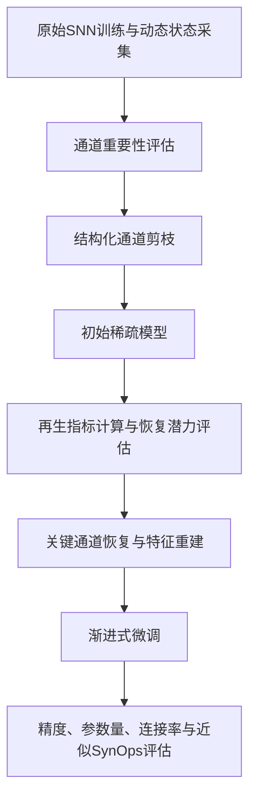
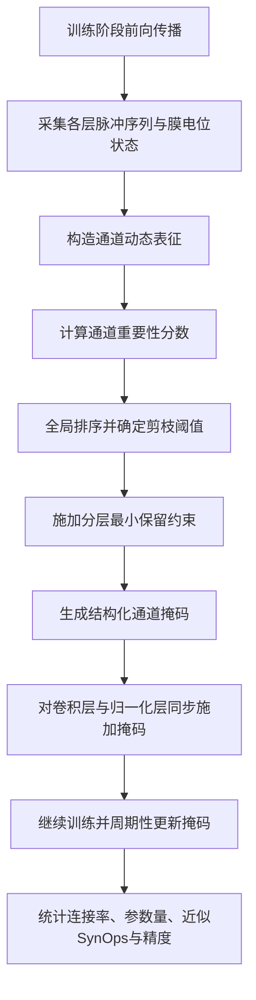

# 3.2 方法总体框架与符号说明

在上一节明确通道冗余问题及现有方法局限的基础上，本文进一步构建一种面向能耗优化的脉冲神经网络压缩方法框架。从章节组织上看，第 3 章主要讨论剪枝方法，第 4 章进一步讨论剪后恢复、重建与渐进式微调；但从全文研究路线来看，这几部分并非彼此割裂，而是共同构成一套由“冗余识别、结构压缩、能力恢复到性能补偿”逐步推进的完整方法体系。因此，在本章展开具体剪枝策略之前，有必要首先从整体上说明全文方法框架，再进一步聚焦本章所承担的剪枝子任务。

从全文角度看，本文方法可概括为前后衔接的两个阶段。第一阶段是基于脉冲动态感知的结构化通道剪枝，其目标是识别深层 SNN 中冗余度较高且能耗相关收益较弱的通道，并通过通道级掩码实现结构压缩；第二阶段是基于再生指标的恢复与重建，其目标是在初始剪枝结果基础上，进一步评估被剪通道的恢复潜力，选择关键通道实施恢复，并结合渐进式微调稳定提升压缩后模型性能。两阶段相互衔接，共同服务于“在保持精度可接受的前提下降低结构规模与近似运行开销”这一总体研究目标。

在此总体框架下，第 3 章所讨论的内容属于前一阶段，即剪枝阶段的方法主体。该阶段并非将剪枝理解为训练结束后的单次删减操作，而是将通道动态统计、重要性评估、掩码更新和结构约束嵌入训练过程之中，使网络能够在迭代优化期间逐步暴露冗余通道，并据此完成更稳定的结构压缩。与传统基于静态参数的通道裁剪方式相比，这种处理方式更符合 SNN 依赖时间展开与事件驱动计算的运行特点，也更有利于将结构压缩收益与近似能耗相关收益联系起来[1-4]。为便于后续方法推导与算法描述，本节首先给出全文方法总体流程及本章剪枝子流程，随后对本章所用关键符号进行统一说明，并进一步界定第 3 章与第 4 章在方法层面的边界。

## 3.2.1 本文总体方法框架与本章剪枝子流程

从论文整体方法来看，本文提出的压缩流程如图 3-1 所示。首先，在原始脉冲神经网络训练过程中采集通道动态信息，并基于脉冲活动与通道差异性执行结构化通道剪枝，得到初始稀疏模型及相应的结构统计结果；随后，在剪枝结果基础上进一步引入再生指标，对被剪通道的恢复潜力进行评估，筛选需要恢复或重点补偿的关键结构；最后，通过恢复机制与渐进式微调重建压缩后网络的特征表达能力，并对最终模型的精度、结构规模与近似能耗相关指标进行综合评价。该总体安排有助于从全文层面形成较为完整的方法闭环，从而避免第 3 章与第 4 章在结构上彼此割裂。

图 3-1 全文方法总体框架

需要说明的是，图 3-1 反映的是全文研究路线，其中“结构化通道剪枝”对应第 3 章的核心内容，“再生指标计算与恢复潜力评估”“关键通道恢复与特征重建”“渐进式微调”则是第 4 章进一步展开的重点。因此，为保证本章论述重点集中，下面仍将着重讨论图 3-1 的前半部分，即剪枝阶段的具体流程。

就第 3 章而言，本文所提出的剪枝子流程面向深层 SNN 的训练全过程展开，其具体过程如图 3-2 所示。与仅依赖预训练模型静态参数的剪枝方式不同，该流程在训练过程中持续采集候选通道的动态状态，并在若干训练间隔后更新一次通道掩码，从而逐步完成由稠密结构向稀疏结构的过渡。这种渐进式结构调整方式有助于减弱一次性强剪枝带来的性能震荡，也有助于使通道重要性判断建立在更充分的时空统计信息之上。

图 3-2 第 3 章剪枝子流程图

具体而言，本章剪枝子流程可分为以下几个阶段。

第一阶段为动态状态采集。在模型前向传播过程中，本文在候选卷积层后引入通道级统计模块，对各层输出脉冲序列及对应的膜电位状态进行记录。由于 SNN 的通道贡献不仅体现在显式脉冲发放上，也体现在接近阈值但尚未发放的电位响应之中，因此，该阶段为后续通道重要性评估提供了更完整的动态信息基础。

第二阶段为通道表征构造与重要性计算。对每一层而言，本文不直接使用单一活动强度作为评分依据，而是基于脉冲输出与膜电位响应构造通道动态表征，并进一步从两个维度进行评价：其一，通道是否在完整时间窗口内保持有效发放；其二，该通道与同层其他通道相比是否具有较强差异性。前者用于避免保留几乎不参与事件传播的低活跃通道，后者用于抑制表征高度重叠的冗余通道。通过二者结合，可获得更适合 SNN 场景的通道重要性分数。

第三阶段为全局排序与结构化剪枝。得到各层通道评分后，本文并不在每一层独立设置固定剪枝比例，而是先将所有候选通道的重要性分数统一汇总，再依据全局排序结果确定剪枝阈值。采用全局竞争机制的原因在于，不同层中通道的重要性分布并不一致，若机械执行逐层等比例裁剪，容易在关键层产生过剪问题。为缓解这一风险，本文进一步设置分层最小保留约束。当某层依据全局阈值得到的保留通道数低于安全下限时，额外保留该层评分较高的部分通道，以维持网络基本表达能力。

第四阶段为掩码施加与迭代更新。完成通道筛选后，生成对应的二值掩码，并将其同步作用于卷积层输出通道及相应归一化层参数，使被剪通道在训练过程中失效。由于本文采用的是训练过程中的周期性掩码更新策略，模型在每次结构调整后仍继续参与后续训练，从而使剩余通道能够逐步适应新的结构配置。应当指出，掩码更新的目的在于提高剪枝过程的稳定性，其本质仍服务于通道筛选与结构压缩，而不等同于面向剪后恢复的重建机制。

第五阶段为压缩效果评估。考虑到本文聚焦的是面向能耗优化的算法研究，而非特定神经形态芯片上的真实功耗实测，因此最终效果主要从四个方面进行评价：一是分类精度，用于衡量模型可用性；二是连接保留率，用于反映稀疏模型中有效连接的削减程度；三是紧凑模型参数量，用于刻画结构重构后的静态规模；四是近似 SynOps，用于估计事件驱动条件下潜在的运行开销变化[1][4][8]。这一评价体系与第 2 章构建的近似能耗分析口径保持一致，同时也为第 4 章恢复与重建阶段的效果比较提供了统一基准。

综合来看，本文总体方法将通道动态信息采集、结构化剪枝、恢复重建和能耗相关统计分析整合为一个连续框架，使模型压缩不再只是单纯的参数删减，而成为围绕“冗余识别 - 结构压缩 - 能力恢复 - 近似能耗收益”展开的整体优化过程。就本章而言，其核心任务仍然是完成这一整体框架中的前半部分，即建立可靠的通道剪枝子流程，为后续恢复与重建奠定结构基础。

## 3.2.2 关键符号与变量定义

为便于后续公式推导与算法描述，现对本章使用的主要符号作统一说明。若无特殊说明，下标 $l$ 表示网络层索引，下标 $c$ 表示通道索引，且所有量默认在第 $l$ 层语境下定义。表 3-1 给出了本章主要符号及其含义。

表 3-1 关键符号说明

| 符号 | 含义 |
| --- | --- |
| $T$ | 时间步长度，即 SNN 的时间展开步数 |
| $N$ | 一个 batch 中的样本数 |
| $C_l$ | 第 $l$ 层输出通道数 |
| $H_l, W_l$ | 第 $l$ 层特征图的空间尺寸 |
| $x^{(l)} \in \mathbb{R}^{T \times N \times C_l \times H_l \times W_l}$ | 第 $l$ 层在整个时间窗口内的脉冲序列 |
| $v^{(l)} \in \mathbb{R}^{T \times N \times C_l \times H_l \times W_l}$ | 第 $l$ 层对应的膜电位状态序列 |
| $z^{(l)}$ | 通道动态表征张量，通常由脉冲序列与膜电位响应联合构成 |
| $F_c^{(l)}$ | 第 $l$ 层第 $c$ 个通道展开后的表征向量 |
| $\rho_c^{(l)}$ | 第 $l$ 层第 $c$ 个通道在时间窗口内的平均脉冲率 |
| $u_c^{(l)}$ | 第 $l$ 层第 $c$ 个通道的差异性或唯一性评分 |
| $g_c^{(l)}$ | 第 $l$ 层第 $c$ 个通道的脉冲门控因子 |
| $I_c^{(l)}$ | 第 $l$ 层第 $c$ 个通道的综合重要性分数 |
| $M_c^{(l)} \in \{0,1\}$ | 第 $l$ 层第 $c$ 个通道的剪枝掩码，1 表示保留，0 表示剪除 |
| $\alpha$ | 剪枝强度控制参数，用于确定全局排序下的剪枝比例 |
| $\beta$ | 结构更新阶段的辅助比例参数，可用于控制掩码校正或有限结构回补强度 |
| $r_{\min}$ | 分层最小保留比例，用于防止某一层被过度裁剪 |

在上述符号基础上，本文后续方法推导主要围绕三类变量展开。

第一类是动态观测变量，包括脉冲序列 $x^{(l)}$ 和膜电位状态 $v^{(l)}$。这两类信息共同描述了通道在完整时间窗口内的行为轨迹，也是构造通道动态表征的基础。若仅考虑脉冲输出，容易忽略那些尚未发放但已接近阈值的神经元状态；若只考虑膜电位变化，又难以直接体现事件驱动特征。因此，本文将二者联合使用，以增强通道评价的完整性。

第二类是重要性评估变量，包括 $\rho_c^{(l)}$、$u_c^{(l)}$、$g_c^{(l)}$ 和 $I_c^{(l)}$。其中，$\rho_c^{(l)}$ 用于刻画通道在时间窗口内的实际活跃程度；$u_c^{(l)}$ 用于衡量该通道相对于同层其他通道的响应差异；$g_c^{(l)}$ 反映通道是否具备足够有效的发放基础；$I_c^{(l)}$ 则是在此基础上形成的综合评分，是后续剪枝排序的直接依据。这一符号体系的设置，体现了本文对于“通道是否应该保留”这一问题的基本判断逻辑，即既要关注通道是否在工作，也要关注其工作内容是否具有足够独特性。

第三类是结构控制变量，包括掩码 $M_c^{(l)}$、剪枝强度参数 $\alpha$、结构更新辅助参数 $\beta$ 以及分层保留比例 $r_{\min}$。其中，$M_c^{(l)}$ 直接决定通道是否参与后续计算；$\alpha$ 控制全局剪枝强度；$r_{\min}$ 用于约束关键层的最小保留规模；$\beta$ 则用于掩码更新过程中的辅助结构校正。通过这些变量的共同作用，本文将动态评估结果转化为可执行的结构化剪枝决策。

统一上述符号有两个目的。其一，便于在后续章节中将通道冗余分析、重要性公式设计和算法实现保持在同一数学表达框架下，减少符号切换带来的理解负担；其二，有助于将代码实现中的关键变量与论文中的方法表述一一对应，从而增强方法描述的清晰性和可复现性。

## 3.2.3 本章方法与第 4 章恢复方法的边界说明

为了使全文结构更加清晰，有必要在本章开端明确剪枝方法与恢复方法之间的分工。第 3 章的研究重点在于回答“哪些通道应被视为冗余”以及“如何在训练过程中稳定实施结构化剪枝”这两个问题，因此主要围绕通道动态表征构造、重要性评估、全局排序、分层约束以及掩码施加等内容展开。换言之，本章关注的是冗余识别与结构压缩本身，其目标是建立一套合理、稳定且与 SNN 动态特征相匹配的通道筛选机制。虽然本章已经在图 3-1 中给出了包含再生、恢复和重建在内的全文总体方法框架，但这些内容在本章仅承担总览性说明的作用，并不在此处展开技术细节。

需要特别指出的是，本文在剪枝阶段引入的周期性掩码更新及结构约束机制，其目的在于避免通道筛选过程过于剧烈，从而提高训练期间的结构稳定性。这类策略虽然会影响被剪通道和保留通道之间的动态调整过程，但本质上仍属于剪枝流程内部的结构控制手段，并不以恢复已经受损的特征表达能力为直接目标。因此，它与第 4 章所讨论的剪后恢复机制在研究目标上存在本质区别。

第 4 章的重点则转向“剪枝后如何恢复性能”。在经过结构压缩之后，网络可能出现特征表达能力下降、层间协同关系受损以及分类精度回落等问题。针对这些问题，第 4 章将进一步设计面向恢复潜力刻画的再生指标，并在此基础上研究候选恢复通道筛选、恢复优先级排序以及渐进式微调策略。由此可见，第 3 章与第 4 章虽然都围绕压缩后网络结构演化展开，但二者的任务侧重点并不相同：前者关注“如何有效剪枝”，后者关注“如何实现有效恢复”。

从全文逻辑来看，这种章节划分具有明显的递进关系。只有先在第 3 章中完成对冗余通道的有效识别与结构化压缩，才能进一步讨论第 4 章中的恢复潜力评估与性能补偿问题。因而，本章所建立的方法框架不仅是后续重要性指标设计和算法实现的基础，也是下一章恢复方法展开的前提。

## 参考文献

[1] ROY K, JAISWAL A, PANDA P. Towards spike-based machine intelligence with neuromorphic computing[J]. Nature, 2019, 575(7784): 607-617.

[2] ZHENG H, WU Y, DENG L, et al. Going deeper with directly-trained larger spiking neural networks[C]// Proceedings of the AAAI Conference on Artificial Intelligence. 2021, 35(12): 11062-11070.

[3] FANG W, YU Z, CHEN Y, et al. Deep residual learning in spiking neural networks[C]// Advances in Neural Information Processing Systems. 2021, 34: 21056-21069.

[4] DAVIES M, SRINIVASA N, LIN T H, et al. Loihi: A neuromorphic manycore processor with on-chip learning[J]. IEEE Micro, 2018, 38(1): 82-99.

[5] HAN S, POOL J, TRAN J, et al. Learning both weights and connections for efficient neural networks[C]// Proceedings of the 28th International Conference on Neural Information Processing Systems. 2015: 1135-1143.

[6] HE Y, ZHANG X, SUN J. Channel pruning for accelerating very deep neural networks[C]// Proceedings of the IEEE International Conference on Computer Vision. 2017: 1389-1397.

[7] LIU Z, LI J, SHEN Z, et al. Learning efficient convolutional networks through network slimming[C]// Proceedings of the IEEE International Conference on Computer Vision. 2017: 2736-2744.

[8] HOROWITZ M. 1.1 Computing's energy problem (and what we can do about it)[C]// 2014 IEEE International Solid-State Circuits Conference Digest of Technical Papers. Piscataway: IEEE, 2014: 10-14.
