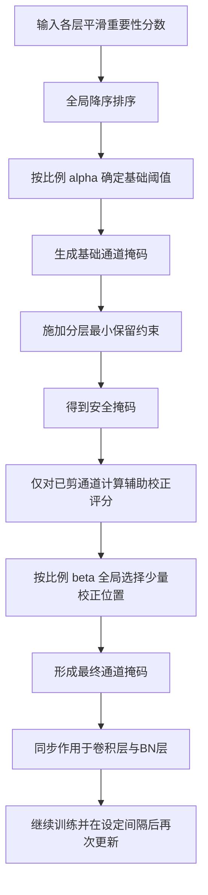

# 3.5 基于重要性排序的结构化剪枝策略

在上一节完成通道重要性指标设计之后，尚需进一步解决的问题是如何将该指标稳定地转化为可执行的结构压缩决策。对于深层脉冲神经网络而言，若仅在单层内部按固定比例删除得分最低的通道，虽然实现方式较为直接，但容易忽略不同层对整体性能的敏感性差异，也难以保证全网络范围内资源分配的合理性。基于此，本文未采用逐层独立、静态比例固定的剪枝方式，而是设计了一种基于全局排序的结构化通道剪枝策略，并在此基础上引入分层最小保留约束、有限掩码校正以及周期性掩码更新机制，以提升结构压缩过程的稳定性与可控性。

从整体流程看，该策略以第 3.4 节定义的通道重要性分数作为唯一排序依据。设第 $l$ 层第 $c$ 个通道的平滑重要性记为 $\tilde{I}_c^{(l)}$，则全网络所有候选通道的重要性集合可写为

$$
\mathcal{I}
=
\left\{
\tilde{I}_c^{(l)}
\mid
l = 1,2,\dots,L,\;
c = 1,2,\dots,C_l
\right\}.
$$

若记全网络候选通道总数为

$$
M = \sum_{l=1}^{L} C_l,
$$

则本文首先将各层的重要性分数拼接为全局向量，再依据降序排序结果确定第一阶段阈值。设 $\alpha \in (0,1)$ 表示第一阶段全局保留比例，则按照排序结果取前 $\lfloor \alpha M \rfloor$ 个通道作为基础保留集合，并据此得到全局阈值 $\tau_{\alpha}$。相应地，第 $l$ 层第 $c$ 个通道的基础掩码可表示为

$$
M_{c,\mathrm{base}}^{(l)}
=
\begin{cases}
1, & \tilde{I}_c^{(l)} > \tau_{\alpha},\\
0, & \tilde{I}_c^{(l)} \le \tau_{\alpha}.
\end{cases}
$$

在该框架下，通道之间的竞争不再局限于层内，而是在全网络统一评价体系下进行比较。若某一层整体冗余度较高，则其低重要性通道会在全局排序中自然处于后部；若另一层对网络性能更为敏感，则其高重要性通道能够在全局竞争中优先被保留。相较于逐层等比例裁剪，全局排序更符合“重要性优先保留”的基本原则，也更有利于在相同压缩强度下减轻关键层过度剪枝所造成的性能损失[5-7]。

然而，单纯依赖全局阈值仍可能造成部分层被过度裁剪。原因在于，不同层中重要性分布范围并不完全一致，若某层整体得分偏低，则即便其中部分通道对网络结构完整性仍然重要，也可能在全局筛选中被大量删除。为避免这一问题，本文进一步引入分层最小保留约束。设第 $l$ 层输出通道数为 $C_l$，最小保留比例为 $r_{\min}$，则该层允许保留的最小通道数定义为

$$
K_l^{\min}
=
\max\!\left(1,\left\lfloor r_{\min} C_l \right\rfloor\right).
$$

若依据全局阈值得到的基础保留通道数满足

$$
\sum_{c=1}^{C_l} M_{c,\mathrm{base}}^{(l)} \ge K_l^{\min},
$$

则保留原始掩码；否则，在第 $l$ 层内部重新选取得分最高的 $K_l^{\min}$ 个通道作为保留集合。相应地，约束后的掩码记为

$$
M_{c,\mathrm{safe}}^{(l)}.
$$

在本文实现中，最小保留比例取 $r_{\min}=0.2$。这一约束并不改变“全局排序优先”的总体原则，而是作为一种安全机制，用于防止结构更新过于激进，从而为后续训练保留最基本的层级表达能力。

在获得安全约束后的基础掩码之后，本文并未立即将掩码固定不变，而是在剪枝阶段引入有限掩码校正机制。需要指出的是，此处所述校正并不属于第 4 章所讨论的恢复与重建方法，其目的并非在剪枝完成后重建受损特征表达，而是作为剪枝过程中的局部结构修正手段，用于纠正少量被过早删除但仍具有训练敏感性的通道。基于这一考虑，本文仅针对当前已被剪除的通道构造辅助评分，并依据该评分在全局范围内选择少量通道重新置为保留状态。

考虑到卷积通道的结构化剪枝在实现上与对应的批量归一化（Batch Normalization, BN）通道一一对应，本文采用 BN 仿射参数梯度作为已剪通道的敏感性代理。设第 $l$ 层第 $c$ 个已剪通道对应的 BN 权重梯度绝对值为 $g_{c}^{(l)}$，对应的平均脉冲率为 $\rho_c^{(l)}$。为避免不同层之间量纲差异对校正排序造成干扰，本文仅在当前层已剪通道集合内部进行归一化处理，分别得到

$$
\hat{g}_{c}^{(l)}
=
\frac{g_c^{(l)} - g_{\min}^{(l)}}{g_{\max}^{(l)} - g_{\min}^{(l)} + \varepsilon},
$$

$$
\hat{\rho}_{c}^{(l)}
=
\frac{\rho_c^{(l)} - \rho_{\min}^{(l)}}{\rho_{\max}^{(l)} - \rho_{\min}^{(l)} + \varepsilon}.
$$

在此基础上，定义已剪通道的辅助校正评分为

$$
R_c^{(l)}
=
\omega_g \hat{g}_{c}^{(l)} + \omega_{\rho} \hat{\rho}_{c}^{(l)},
$$

其中，$\omega_g$ 和 $\omega_{\rho}$ 分别表示梯度敏感性和脉冲活动的权重。在本文实现中，取 $\omega_g = 0.8$、$\omega_{\rho} = 0.2$。这一设计体现了“梯度主导、脉冲辅助”的基本思想：若某个已剪通道在当前训练阶段仍表现出较大的梯度响应，则说明其被删除后仍可能对损失下降具有潜在贡献；若同时该通道还保持一定脉冲活动，则其重新激活后更有可能恢复有效传播。与仅基于梯度或仅基于活动度的校正方式相比，二者加权组合更有利于兼顾优化敏感性与动态可用性。

设 $\beta \in (0,1)$ 表示第二阶段校正比例，本文将辅助评分再次进行全局降序排序，并取前 $\lfloor \beta M \rfloor$ 个得分最高的候选位置执行有限校正，得到最终掩码

$$
M_c^{(l)}
=
\begin{cases}
1, & M_{c,\mathrm{safe}}^{(l)} = 1,\\
1, & M_{c,\mathrm{safe}}^{(l)} = 0 \;\text{且}\; R_c^{(l)} > \tau_{\beta},\\
0, & \text{其他}.
\end{cases}
$$

其中，$\tau_{\beta}$ 为第二阶段的全局阈值。在本文实现中，$\alpha$ 和 $\beta$ 的默认取值分别为 $0.8$ 与 $0.1$。从策略含义上看，$\alpha$ 控制第一阶段基于重要性排序的基础保留规模，$\beta$ 控制第二阶段有限掩码校正的强度。二者叠加后，剪枝过程不再表现为一次性硬删除，而是形成“先按重要性筛选，再对已剪通道作有限校正”的两阶段结构更新过程。

在得到最终掩码后，本文将其同步施加到卷积层与对应的归一化层参数上。对卷积层而言，若第 $l$ 层第 $c$ 个输出通道被剪除，则其对应卷积核组整体置零；对 BN 层而言，则同步将该通道对应的缩放参数和偏置参数置零。若记卷积层权重为 $W^{(l)}$，则掩码施加后的权重可写为

$$
\tilde{W}^{(l)} = W^{(l)} \odot \mathcal{M}^{(l)},
$$

其中，$\mathcal{M}^{(l)}$ 表示由通道掩码扩展得到的卷积核掩码张量，$\odot$ 表示逐元素乘法。由于掩码施加发生在训练过程中，因此每次结构更新后，网络仍继续参与后续优化，使保留通道能够逐步适应新的结构配置。

为了进一步减小结构更新过程中的震荡，本文并未在每个训练周期都执行剪枝，而是采用“预热 + 间隔更新”的调度策略。设当前训练轮次为 $e$，预热轮次为 $E_{\mathrm{warm}}$，剪枝间隔为 $\Delta E$，则掩码更新条件可写为

$$
e \ge E_{\mathrm{warm}}
\quad \text{且} \quad
(e - E_{\mathrm{warm}})\bmod \Delta E = 0.
$$

只有当上述条件满足时，才根据当前累计的重要性统计重新更新掩码；否则，网络保持现有结构继续训练。其原因在于，早期训练阶段模型参数和脉冲活动尚未稳定，若过早依据不充分的统计信息执行通道删除，容易导致剪枝决策偏差。引入预热阶段和间隔更新机制后，通道重要性评估能够建立在相对稳定的动态统计基础之上，同时也有利于减少频繁结构修改所带来的优化扰动。

此外，在每轮完成掩码更新并施加之后，本文会重置当前通道统计缓存，使下一轮重要性评估重新在新的结构状态下累积。这样处理能够避免不同结构阶段的统计量相互混合，提高后续重要性排序的针对性。结合前述重要性平滑策略与本节所述掩码更新机制，本文最终形成了一种适用于深层 SNN 的渐进式结构化剪枝策略，其完整过程如图 3-4 所示。

图 3-4 基于重要性排序的结构化剪枝策略流程图

综合来看，本文提出的剪枝策略并非对低重要性通道进行简单的一次性删除，而是一个由全局排序、分层约束、有限校正和周期性更新共同构成的结构优化过程。通过全局排序，方法能够优先保留全网络范围内更具价值的通道；通过分层最小保留约束，能够避免关键层在全局竞争中被过度裁剪；通过针对已剪通道的有限校正，能够在不引入完整恢复机制的前提下对掩码作出必要修正；通过预热与间隔更新调度，能够减轻结构频繁变化带来的训练不稳定性。上述设计共同构成了本文第 3 章剪枝方法在策略层面的核心实现，也为后续实验分析提供了明确的方法依据。

## 参考文献

[1] ROY K, JAISWAL A, PANDA P. Towards spike-based machine intelligence with neuromorphic computing[J]. Nature, 2019, 575(7784): 607-617.

[2] ZHENG H, WU Y, DENG L, et al. Going deeper with directly-trained larger spiking neural networks[C]// Proceedings of the AAAI Conference on Artificial Intelligence. 2021, 35(12): 11062-11070.

[3] FANG W, YU Z, CHEN Y, et al. Deep residual learning in spiking neural networks[C]// Advances in Neural Information Processing Systems. 2021, 34: 21056-21069.

[4] DAVIES M, SRINIVASA N, LIN T H, et al. Loihi: A neuromorphic manycore processor with on-chip learning[J]. IEEE Micro, 2018, 38(1): 82-99.

[5] HAN S, POOL J, TRAN J, et al. Learning both weights and connections for efficient neural networks[C]// Proceedings of the 28th International Conference on Neural Information Processing Systems. 2015: 1135-1143.

[6] HE Y, ZHANG X, SUN J. Channel pruning for accelerating very deep neural networks[C]// Proceedings of the IEEE International Conference on Computer Vision. 2017: 1389-1397.

[7] LIU Z, LI J, SHEN Z, et al. Learning efficient convolutional networks through network slimming[C]// Proceedings of the IEEE International Conference on Computer Vision. 2017: 2736-2744.
