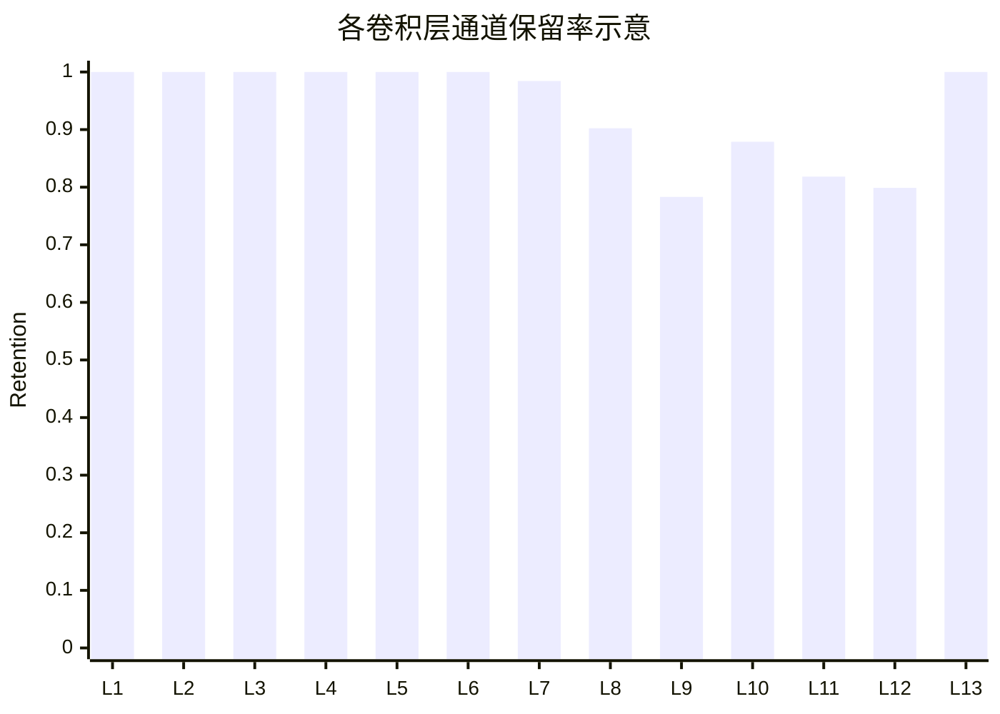

# 3.6 实验设置与结果分析

为验证本文所提出通道重要性评估指标及结构化剪枝策略的有效性，本节结合实验平台中的训练、统计与结构导出流程，对实验设置、评价指标以及结构结果的分析方法作统一说明。考虑到第 3 章的研究重点在于剪枝阶段的结构优化，因此本节主要围绕结构变化、压缩收益及其评价口径展开，而将恢复、重建和渐进式微调等内容留待第 4 章进一步讨论。

本文实验平台基于 PyTorch 与 SpikingJelly 搭建。静态图像分类任务采用 13 层卷积的 snnvgg16_bn 作为主干网络，事件数据任务可切换为 5 层卷积的 SNNDVS5Conv。由于第 3 章所讨论的结构化通道剪枝及其统计过程主要围绕 snnvgg16_bn 展开，因此本节分析对象以静态图像分类任务为主。实验支持 CIFAR-10、CIFAR-100 和 Tiny-ImageNet 等数据集，前两者输入分辨率为 $32 \times 32$，后者输入分辨率为 $64 \times 64$；在静态图像任务中，仿真时间步长统一设置为 $T=4$，以保证不同数据集之间具有可比较的时序展开长度[1-5]。为便于复现实验流程，表 3-2 给出了本章实验涉及的主要任务配置。

| 数据集 | 类别数 | 输入尺寸 | 主干网络 | 时间步长 |
| --- | ---: | ---: | --- | ---: |
| CIFAR-10 | 10 | $32 \times 32$ | snnvgg16_bn | 4 |
| CIFAR-100 | 100 | $32 \times 32$ | snnvgg16_bn | 4 |
| Tiny-ImageNet | 200 | $64 \times 64$ | snnvgg16_bn | 4 |

表 3-2 本章静态图像实验的主要任务配置

在训练过程中，网络首先按照常规监督学习方式完成参数更新，并在达到设定的预热轮次后周期性执行一次掩码更新。若记当前训练轮次为 $e$，剪枝预热轮次为 $E_{\mathrm{warm}}$，剪枝间隔为 $\Delta E$，则只有满足

$$
e \ge E_{\mathrm{warm}}
\quad \text{且} \quad
(e-E_{\mathrm{warm}})\bmod \Delta E = 0
$$

时，才根据第 3.4 节所定义的重要性分数和第 3.5 节所给出的掩码更新规则执行结构化剪枝。实验设置中，第一阶段基础保留比例与第二阶段有限校正比例分别由参数 $\alpha$ 和 $\beta$ 控制，其默认取值为 $\alpha=0.8$、$\beta=0.1$。在每一轮结构更新后，实验过程均保存最佳精度对应的模型参数、当前掩码矩阵、压缩后通道配置以及最终统计信息，从而为后续的结构分析与性能比较提供统一的数据来源。

为了同时衡量分类性能与压缩收益，本文在实验中采用测试集 Top-1 准确率、连接保留率、紧凑参数量和近似 SynOps 作为主要评价指标。其中，Top-1 准确率直接由测试集分类结果统计得到，用于反映剪枝后模型的任务性能。连接保留率用于刻画掩码作用下模型中非零权值的保留程度，其定义为

$$
R_{\mathrm{conn}}
=
\frac{N_{\mathrm{nonzero}}}{N_{\mathrm{total}}}\times 100\%,
$$

其中，$N_{\mathrm{nonzero}}$ 表示卷积层和全连接层中非零权值总数，$N_{\mathrm{total}}$ 表示相应权值的总数。该指标反映的是掩码作用后的有效连接规模，而非真正紧凑模型的参数规模，因此在实验报告中需要与参数保留率区分讨论。

对结构化通道剪枝而言，更能体现部署意义的指标是紧凑模型参数量。设压缩后的 13 个卷积层通道配置记为 $\{\tilde{C}_1,\tilde{C}_2,\dots,\tilde{C}_{13}\}$，分类类别数记为 $N_{\mathrm{cls}}$，则本文实验中的紧凑参数量统计公式为

$$
P_{\mathrm{compact}}
=
\sum_{l=1}^{13}\tilde{C}_l \tilde{C}_{l-1} k_l^2
+ \tilde{C}_{13}\times 512
+ 512\times 512
+ 512\times N_{\mathrm{cls}}
+ N_{\mathrm{cls}},
$$

其中约定 $\tilde{C}_0=3$，且卷积核尺寸统一取 $k_l=3$。据此可进一步定义参数保留率

$$
R_{\mathrm{param}}
=
\frac{P_{\mathrm{compact}}}{P_{\mathrm{dense}}}\times 100\%,
$$

其中 $P_{\mathrm{dense}}$ 为对应稠密模型的参数量。由于结构化通道剪枝会同时影响当前层输出通道数和下一层输入通道数，因此参数保留率通常低于简单的通道保留率，这一点也正体现了第 3.3 节所分析的跨层传递效应[6-8]。

对于能耗相关收益，本文采用基于平均脉冲率的近似 SynOps 指标进行估计。若第 $l$ 层输入脉冲率记为 $r_{\mathrm{in}}^{(l)}$，输出特征图尺寸为 $H_l \times W_l$，则卷积层近似突触操作数可写为

$$
\mathrm{SynOps}_l
\approx
T \cdot H_l \cdot W_l \cdot \tilde{C}_{l-1} \cdot \tilde{C}_l \cdot k_l^2 \cdot r_{\mathrm{in}}^{(l)}.
$$

在本文实验设置中，第 1 个卷积层输入为原始图像，因此其输入脉冲率近似取为 1；其余卷积层则使用前一层输出脉冲率作为输入脉冲率的近似估计。对分类头部分，进一步以最后一层卷积输出脉冲率近似估计三个全连接层的输入脉冲活动，由此得到整个紧凑模型的近似 SynOps 统计值。需要指出的是，这一指标描述的是基于脉冲稀疏性的近似运行开销，而非具体硬件平台上的实测能耗，因此在论文表述中应将其理解为能耗相关的代理指标，而不是硬件能耗本身[1][8]。

在完成评价口径统一之后，还需要进一步分析剪枝结果在网络层间的分布规律。依据实验导出的最终掩码矩阵，可以统计得到 13 个卷积层各自的输出通道保留数量及其比例，结果如表 3-3 所示。

| 卷积层 | 原始通道数 | 保留通道数 | 剪除通道数 | 通道保留率 |
| --- | ---: | ---: | ---: | ---: |
| 1 | 64 | 64 | 0 | 100.00% |
| 2 | 64 | 64 | 0 | 100.00% |
| 3 | 128 | 128 | 0 | 100.00% |
| 4 | 128 | 128 | 0 | 100.00% |
| 5 | 256 | 256 | 0 | 100.00% |
| 6 | 256 | 256 | 0 | 100.00% |
| 7 | 256 | 252 | 4 | 98.44% |
| 8 | 512 | 462 | 50 | 90.23% |
| 9 | 512 | 401 | 111 | 78.32% |
| 10 | 512 | 450 | 62 | 87.89% |
| 11 | 512 | 419 | 93 | 81.84% |
| 12 | 512 | 409 | 103 | 79.88% |
| 13 | 512 | 512 | 0 | 100.00% |
| 合计 | 4224 | 3801 | 423 | 89.99% |

表 3-3 当前最终掩码对应的各卷积层通道分布统计

为更直观地观察层间压缩分布，图 3-5 给出了上述 13 个卷积层的通道保留率示意图。可以看出，浅层卷积块几乎未发生明显压缩，而真正的剪枝主要集中在中后部卷积层，尤其体现在第 8 至第 12 层之间。这一现象表明，在全局排序与分层最小保留约束共同作用下，模型倾向于优先保留浅层用于基础边缘纹理提取的通道，同时将压缩重点放在表征维度更高、通道冗余更容易出现的中深层部分。值得注意的是，第 13 层在当前掩码中被全部保留，这说明最末层语义汇聚通道对分类头输入具有较强敏感性，全局排序机制并未将其判定为可大规模删除的冗余部分。

图 3-5 当前最终掩码对应的各卷积层通道保留率示意图

若进一步按照本文实验中的紧凑参数量统计口径对表 3-3 所对应的压缩结构进行计算，则可得到该结构的参数保留率约为 $76.9\%$。与 $89.99\%$ 的通道总体保留率相比，参数保留率下降更为明显，其原因在于，当某一层输出通道被删除后，下一层相应输入通道的紧凑结构规模也会同步缩减，因此参数收益具有跨层累积效应。这一结果与第 3.3 节的理论分析保持一致，也说明结构化通道剪枝的压缩收益并不能仅由单层通道删除比例直接刻画，而需要结合网络拓扑整体加以分析。

综合本节实验设置与结构统计结果可以看出，本文提出的通道重要性评估与结构化剪枝策略表现出较清晰的层间选择规律：浅层与末层被优先保护，中间高维特征阶段承担了主要压缩任务；在整体通道保留率仍接近 $90\%$ 的情况下，紧凑模型参数规模已经下降到原模型的约四分之三。这说明该方法不仅能够根据全局重要性排序自动识别更具冗余性的卷积层阶段，而且能够在保持关键特征传递路径相对稳定的前提下实现较为可观的结构压缩收益。后续第 4 章将在此基础上进一步讨论剪枝之后的恢复与微调问题，以提升高压缩条件下的精度保持能力。

## 参考文献

[1] ROY K, JAISWAL A, PANDA P. Towards spike-based machine intelligence with neuromorphic computing[J]. Nature, 2019, 575(7784): 607-617.

[2] ZHENG H, WU Y, DENG L, et al. Going deeper with directly-trained larger spiking neural networks[C]// Proceedings of the AAAI Conference on Artificial Intelligence. 2021, 35(12): 11062-11070.

[3] FANG W, YU Z, CHEN Y, et al. Deep residual learning in spiking neural networks[C]// Advances in Neural Information Processing Systems. 2021, 34: 21056-21069.

[4] KRIZHEVSKY A. Learning multiple layers of features from tiny images[R]. Toronto: University of Toronto, 2009.

[5] LI H, LIU H, JI X, et al. CIFAR10-DVS: an event-stream dataset for object classification[J]. Frontiers in Neuroscience, 2017, 11: 309.

[6] HAN S, POOL J, TRAN J, et al. Learning both weights and connections for efficient neural networks[C]// Proceedings of the 28th International Conference on Neural Information Processing Systems. 2015: 1135-1143.

[7] HE Y, ZHANG X, SUN J. Channel pruning for accelerating very deep neural networks[C]// Proceedings of the IEEE International Conference on Computer Vision. 2017: 1389-1397.

[8] LIU Z, LI J, SHEN Z, et al. Learning efficient convolutional networks through network slimming[C]// Proceedings of the IEEE International Conference on Computer Vision. 2017: 2736-2744.
